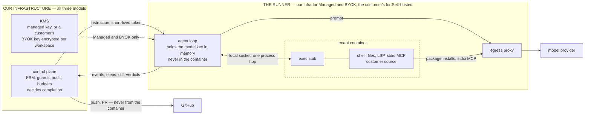
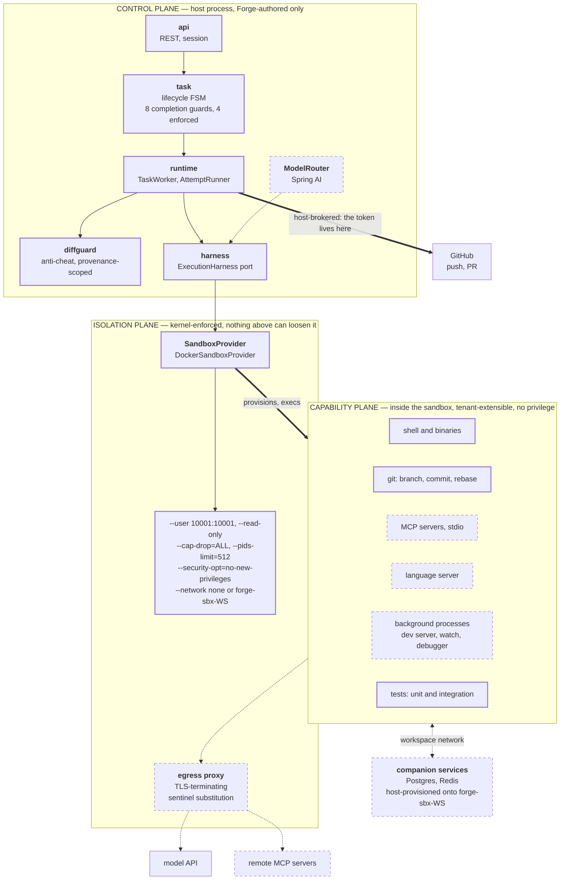
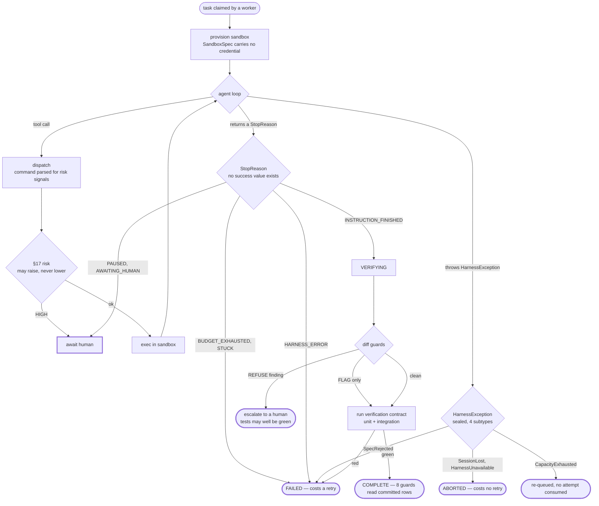
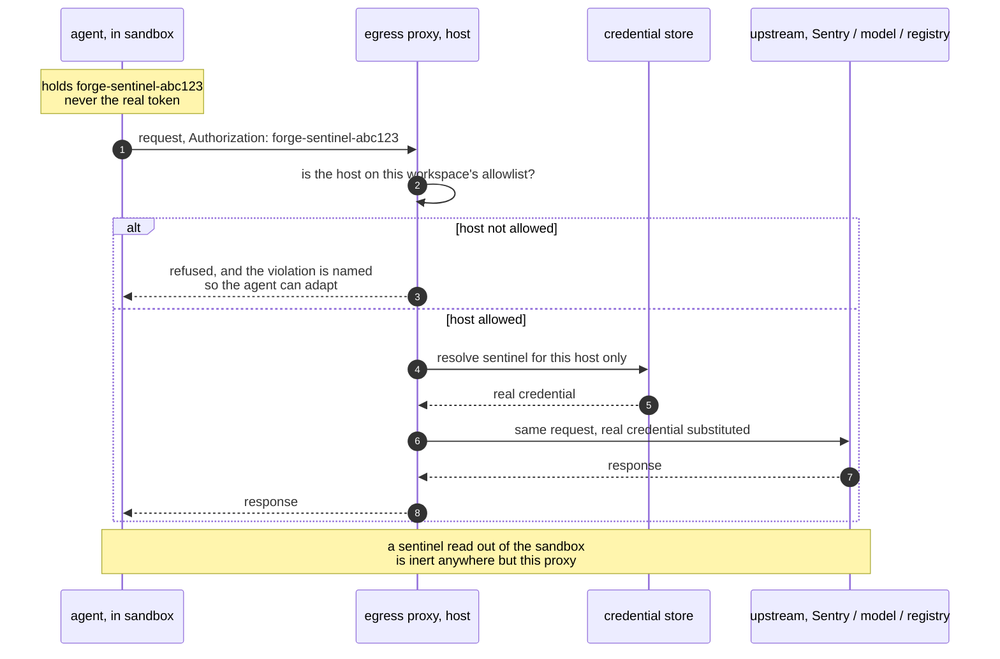

# Forge — Technical Architecture Plan

## Context

`forge-backend` is currently a bare Spring Boot 4.1 / Java 25 skeleton: `ForgeApplication.java`, an empty `application.yaml`, and a dependency set (JPA, Redis, Flyway, Security + OAuth2 client/resource-server, Spring AI 2.0 OpenAI, Validation, WebMVC). There is no domain code, no schema, no module structure. Everything below is greenfield.

We are building **Forge**: a multi-tenant SaaS where a customer hands over ownership of a repository and Forge continuously maintains it — detecting work, planning, implementing, verifying, and opening PRs, escalating to a human when it must. The hard part is not "call an LLM with tools." The hard part is that engineering tasks are **long-running, failure-prone, and iterative**, which means the system must be able to crash on attempt 4 of 7, resume from a durable checkpoint, remember that attempts 1–3 already failed and why, and never let a language model declare victory on its own.

The intended outcome of this plan: a modular monolith with boundaries sharp enough that the agent runtime and the execution sandbox can be extracted into separate services later without a rewrite, and with the mechanical substrate (state machine, queue, leases, sandbox, tools) proven correct *before* any LLM is wired in.

### Decisions locked with the user

| Decision | Choice |
|---|---|
| Orchestration | Hand-rolled: Postgres state machine + transactional outbox + Redis Streams queue |
| Model strategy | Provider-agnostic `ModelRouter` port over Spring AI; OpenAI first; roles bound in config |
| v1 target | Design-partner alpha — real multi-tenancy and RLS from day one, billing/quotas/self-serve deferred |
| Sandbox | **Docker on a dedicated worker VM, behind a `SandboxProvider` port** (see §16) |

On the sandbox: the user has no Kubernetes experience and correctly declined to accept a design they cannot validate. Shipping a k8s control plane to a team that cannot debug it is a worse risk than the isolation gap. We take Docker-on-a-VM, harden it with flags that are readable in a single `docker run` line, and keep the port narrow so a stronger backend drops in later. §16 states the residual risk and the exact trigger for closing it.

---

## Challenges to the proposed architecture

The brief is unusually strong. Six things in it are wrong or under-specified, and they change the design.

**1. `Workspace → Agents` should not exist as an entity.**
There is no useful persistent "Agent" row. What actually exists is a *Task*, an *Attempt* executing it, and a *configuration* governing that execution. Modelling "Agent" as an actor is a chatbot-era instinct that leaks into everything: you end up asking "which agent owns this task", "is the agent busy", "what is the agent's state" — all of which are really task and attempt questions. Replace with **`AgentProfile`**: a named, versioned bundle of `{model routing, tool allowlist, autonomy level, budget defaults}` attached to a `ManagedRepository`. It is config, not an actor. This removes an entire class of confused state.

**2. The state machine conflates two levels, and that is why it looks awkward.**
`CREATED / QUEUED / BLOCKED / COMPLETED` are **task lifecycle**. `ANALYZING / PLANNING / EXECUTING / VERIFYING / DIAGNOSING / REPLANNING` are **phases within a single attempt**. Flattening them forces the question "we're in DIAGNOSING — which attempt?" to be answered implicitly, and makes the failure loop a set of edges rather than a bounded sub-process. Split into a **two-level FSM**: Task FSM (§10.1) and Attempt FSM (§10.2). The task is `RUNNING`; the attempt is `DIAGNOSING`.

**3. `RESUMED` is not a state.** It is an event (`RESUME`) that transitions `AWAITING_HUMAN → READY`. Adding it as a state means every human-pause path needs an extra hop that carries no information and cannot be queried usefully.

**4. `BLOCKED` conflates three unrelated conditions** with three different resolution paths, owners, and alert routes: blocked on a dependency edge (resolves when another task completes), blocked on a human (resolves when a person answers), and blocked on resources (resolves when budget resets or an operator intervenes). Split into `BLOCKED_ON_DEPENDENCY`, `AWAITING_HUMAN`, `SUSPENDED`. A single `BLOCKED` bucket makes the ops dashboard useless on day one.

**5. "Webhook events create or update tasks" is a task-storm generator.**
A busy repo emits hundreds of events an hour. Auto-creating tasks means auto-spending money on work nobody asked for. Insert a **`Signal`** entity between webhook and task: webhooks produce coalesced, deduplicated Signals; triage (rules first, LLM only for genuinely ambiguous cases) decides whether a Signal becomes a Task. In MVP the default is **`auto_create_tasks: false`** — Signals land in an inbox a human promotes. Autonomy here is earned per repo after you can measure triage precision.

**6. The dependency graph is really two graphs and must not share a table.**
The *work graph* (issue/PR/task, `BLOCKS`, human-confirmable, hundreds of edges, durable, audited) and the *code graph* (module→module, derived from static analysis, hundreds of thousands of edges, regenerable, invalidated by every commit) have nothing in common except the word "graph." One table means either the code graph pollutes scheduling decisions or the work graph inherits a regeneration lifecycle it must not have. Separate: `work_dependency` (§12) and a post-MVP `code_graph_edge` cache keyed by commit SHA.

**Two things the brief omits that dominate the design:**

- **Verification is the product** (§26 risk 1). "Tests pass" is not "the change is correct." The classic autonomous-agent failure is deleting the failing test. There must be a mechanical verification contract *and* diff guards that treat test deletion / `@Disabled` / assertion weakening as policy violations. No amount of model quality substitutes for this.
- **The sandbox must never hold a GitHub token** (§16, §17). Repository content — issue bodies, PR comments, READMEs, code comments — is attacker-controlled in the general case, and it flows into a model that has tool access. A token inside the sandbox plus egress is a one-prompt exfiltration. All git write operations are **host-brokered**.

---

## 1. High-level architecture

Three planes, one deployable artifact, three runtime roles.

```
                       ┌──────────────────────────────────────────┐
   Browser ─────────►  │  CONTROL PLANE   (role=api)              │
   GitHub webhooks ──► │  REST, OAuth login, App install,         │
                       │  webhook receipt (store-then-ack),       │
                       │  task CRUD, approvals, SSE feed          │
                       └───────────────┬──────────────────────────┘
                                       │ writes + transactional outbox
                       ┌───────────────▼──────────────────────────┐
                       │  PostgreSQL  — SOURCE OF TRUTH           │
                       │  tenancy · tasks · attempts · steps ·    │
                       │  transitions · evidence · graph ·        │
                       │  memory · audit · outbox                 │
                       └───────────────┬──────────────────────────┘
                                       │ outbox relay
                       ┌───────────────▼──────────────────────────┐
                       │  Redis — DERIVED ONLY                    │
                       │  Streams queues · leases · rate limits · │
                       │  installation-token cache · SSE pub/sub  │
                       └───────────────┬──────────────────────────┘
                                       │ consume + lease
       ┌───────────────────────────────▼──────────────────────────┐
       │  AGENT PLANE  (role=worker)                              │
       │  ┌────────────────────────────────────────────────────┐  │
       │  │ Agent Runtime — deterministic loop, NOT an LLM     │  │
       │  │  phase handler → context → model → tools →         │  │
       │  │  persist → FSM.next() → checkpoint → heartbeat     │  │
       │  └───┬──────────────┬───────────────┬─────────────────┘  │
       │      │              │               │                    │
       │  ModelRouter    ToolDispatcher   Verification            │
       │  (sup/exec)     (authz gate)     (mechanical)            │
       └──────┼──────────────┼───────────────┼────────────────────┘
              │              │               │
        OpenAI/etc     SandboxProvider   GitHub API (host-brokered)
                             │
                  ┌──────────▼───────────┐
                  │ EXECUTION PLANE      │
                  │ dedicated worker VM  │
                  │ Docker, no token,    │
                  │ egress deny-by-defer │
                  └──────────────────────┘

       SCHEDULER  (role=scheduler, single leader via Redis lock)
       runnability scan · lease reconciler · sandbox reaper ·
       budget rollups · CI polling fallback
```

**Why three roles from one artifact.** API latency and agent throughput have opposite scaling curves: the API is bursty and cheap, workers are long-running and expensive. One artifact with `forge.role=api|worker|scheduler` (Spring profiles gating `@Configuration`) gives independent scaling and independent failure domains without a distributed build, without cross-service contracts, and without losing local-dev simplicity (`role=all`).

- *Alternatives:* one process doing everything (agent loops starve HTTP threads and every deploy kills in-flight attempts); microservices from day one (three deploy pipelines and a network boundary before the domain model has stabilised — the boundaries would be wrong).
- *Why preferred:* extraction later is a build-file change plus a transport swap, because modules already talk through ports and the outbox, not through shared beans.
- *What could go wrong:* the shared artifact tempts a worker to reach into an API-only bean. Spring Modulith verification tests (§2) fail the build on that.

**Why Postgres is the only source of truth.** Every durable fact — state, transitions, attempts, evidence, cost — is a row. Redis is a cache and a transport, and **losing Redis entirely must cost latency, not correctness**: the reconciler rebuilds queue state by scanning Postgres for tasks with expired leases. This is a design property to test explicitly, not an aspiration.

---

## 2. Spring Boot module boundaries

Use **Spring Modulith**. It gives compile-time-verified package boundaries, a generated dependency diagram, and — critically — the `event_publication` registry, which is a transactional outbox we would otherwise hand-roll.

Root: `dev.tushar.forge`. Each module is a direct sub-package with a package-private internal and an explicit public API surface (`::api` named interface or a `spi` sub-package). Cross-module calls go through published interfaces or domain events. **No cross-module JPA entity references** — foreign keys exist in the database, but the Java side crosses boundaries by ID.

```
dev.tushar.forge
├── platform/                 (no domain knowledge; everything may depend on these)
│   ├── tenancy               TenantContext, RLS GUC binding, @TenantScoped
│   ├── crypto                envelope encryption, key rotation, secret refs
│   ├── events                domain event bus + outbox relay
│   ├── jobs                  queue port, Redis Streams adapter, leases, reconciler
│   ├── blob                  large-payload store (logs, prompts, diffs)
│   └── observability         MDC, metrics, tracing
│
├── iam/                      User, Identity, Workspace, Membership, Session, roles
├── githubauth/               OAuth login only. Depends on iam. No repo access. Ever.
├── githubapp/                Installations, JWT→installation tokens, repo sync, grants
├── githubapi/                Client facade: rate limiting, retry, ETag cache, idempotency
├── githubwebhook/            HMAC verify, store-then-ack, normalise → Signal
│
├── repo/                     ManagedRepository, VerificationContract, AgentProfile, snapshots
├── signal/                   Signal ingestion, coalescing, triage, inbox
├── task/                     Task aggregate, TaskStateService, transition table, guards
├── graph/                    work_dependency, cycle detection, runnability predicate
├── scheduler/                runnable scan, priority, admission control, concurrency caps
│
├── runtime/                  THE AGENT RUNTIME. Attempt loop, phase handlers, checkpoints
│   ├── attempt               Attempt/Step lifecycle, resume
│   ├── phase                 Initializing/Analyzing/Planning/Executing/Verifying/Diagnosing
│   └── escalation            deterministic escalation triggers
├── planning/                 Plan artifact, schema validation, plan-vs-actual drift
├── context/                  deterministic context assembly + token budgeting
├── llm/                      ModelRouter port, role binding, structured output, cost meter
├── tools/                    ToolDefinition, registry, authorization, dispatcher, truncation
├── sandbox/                  SandboxProvider port + docker adapter + reaper
├── verification/             contract execution, diff guards, evidence extraction
├── memory/                   long-term repo knowledge, staleness, retrieval
├── policy/                   risk classification, effective authority, approvals
├── cost/                     budgets, meters, circuit breakers
├── audit/                    append-only audit log
└── api/                      REST controllers + DTOs only. Zero business logic.
```

**Dependency rules enforced by `ApplicationModules.of(ForgeApplication.class).verify()` in a test:**

| Rule | Rationale |
|---|---|
| `runtime` must not depend on `api`, `githubwebhook`, `iam` | The runtime must be extractable as a service |
| `llm` must not depend on `task`, `runtime`, `policy` | Keeps the LLM layer a dumb transport; no business rules in prompts-adjacent code |
| `tools` may depend on `sandbox`, `githubapi`, `policy` — never on `llm` | Tools are called *by* the runtime, not by the model layer |
| `policy` must not depend on `llm` | Authority decisions must be computable without a model |
| Nothing depends on `api` | |
| `sandbox` must not depend on `githubapp` | Structural guarantee that no token path reaches the sandbox |
| No `com.github.dockerjava..` import outside `sandbox.docker` | Keeps the substrate swappable (§16) |

The `sandbox ↛ githubapp` rule is a security control expressed as a build constraint. It is worth more than a comment.

### Abstraction hygiene, enforced

Appendix A sets the rule that an abstraction must answer to a pressure that exists *today*. Left to review discipline, the Spring reflex reintroduces `XService`/`XServiceImpl` pairs within weeks. So it is enforced the same way every other boundary here is — in CI.

Introduce one annotation, in `platform`:

```java
/** A deliberate abstraction seam. Justification is mandatory and reviewed. */
@Retention(RUNTIME) @Target(TYPE)
public @interface Port {
    String value();   // why this seam exists — the pressure, in one sentence
}
```

ArchUnit rules in M0:

1. **No orphan interfaces.** Any interface under `dev.tushar.forge..` must satisfy at least one of: annotated `@Port`; a Spring Data repository; `sealed` (a sum type such as `SupervisorDirective`, not an abstraction seam); or having ≥2 implementations in `main`. Otherwise the build fails.
2. **No `Impl` suffix.** `noClasses().should().haveSimpleNameEndingWith("Impl")` — the naming convention that makes the anti-pattern feel normal.
3. **`@Port` count is visible.** The rule prints the current `@Port` inventory on every run, so growth is noticed in review rather than discovered a year later.

The starting inventory is exactly four, and each names its pressure:

| Port | Justification |
|---|---|
| `SandboxProvider` | Docker adapter + in-memory fake today; k8s/gVisor on the extraction path (§16) |
| `ModelRouter` | Provider adapter + fake; testing the loop without spending tokens (§13) |
| `JobQueue` (`platform.jobs`) | Redis Streams adapter + in-memory fake for deterministic FSM tests |
| `BlobStore` (`platform.blob`) | Object-store adapter + local filesystem fake |

Every one clears trigger 1 because the fake is a genuine second implementation the test strategy depends on. `TaskStateService`, `EffectiveAuthorityResolver`, the phase handlers, and the diff guards are **concrete classes** — they are tested directly against a real Postgres via Testcontainers, so no seam is needed. If someone later wants an interface on one of them, rule 1 forces them to add `@Port` with a written justification, which turns a reflex into a decision.

- *What could go wrong:* the rule fights a legitimate case — say a third-party library requires an interface. Then `@Port("required by X")` is the correct, honest escape hatch. The goal is not to prevent interfaces; it is to prevent *unconsidered* ones.

**Why Modulith over Maven/Gradle multi-module.** Multi-module gives harder enforcement but forces the boundaries to be final before we know them, and makes cross-cutting refactors expensive during the phase where they are most frequent. Modulith enforces the same rules in a test, at a tenth of the friction, and the promotion path (Modulith package → Gradle subproject → service) is mechanical.
- *What could go wrong:* Modulith on Boot 4.1 may lag. If the verification API is unstable, fall back to ArchUnit rules expressing the same table — same enforcement, more hand-written.

---

## 3. Domain model

Seven aggregates. Aggregate = transactional consistency boundary; anything crossing one is an event or an ID reference.

| Aggregate | Root | Contains | Invariant it protects |
|---|---|---|---|
| **Workspace** | `Workspace` | Members, AgentProfiles, Budgets | Every tenant row hangs off exactly one workspace |
| **Installation** | `GithubInstallation` | available repos, granted permissions | Forge's GitHub authority is bounded by what was installed |
| **ManagedRepository** | `ManagedRepository` | VerificationContract, settings, snapshots | A repo is only maintained after explicit opt-in |
| **Task** | `Task` | Attempts, Steps, ToolCalls, Results, Evidence, Transitions, Plans | Exactly one attempt in flight; state changes only via the FSM |
| **DependencyGraph** | per-workspace | work_dependency edges | No cycles among confirmed blocking edges |
| **RepoKnowledge** | per-repo | knowledge items | Knowledge is SHA-stamped and supersedable, never silently mutated |
| **Signal** | `Signal` | raw deliveries, dedup key | Webhook noise is coalesced before it can cost money |

**Task is deliberately a large aggregate.** Attempts, steps, tool calls, and evidence are written together, read together, and are meaningless apart. Splitting them would mean coordinating four transactions on a crash-resume path — exactly where correctness matters most.
- *What could go wrong:* the Task aggregate becomes a write hotspot on a very active repo. Mitigated because writes are serialised per task anyway by the single-attempt lease, so contention is bounded by concurrent *tasks*, not concurrent writers per task.

**Key entities beyond the obvious:**

- `AgentProfile` — replaces the brief's "Agent". Versioned config: model role bindings, tool allowlist, autonomy level, budget defaults, escalation thresholds. Attached to a ManagedRepository, resolvable to workspace default.
- `VerificationContract` — per repo: setup command, build command, test command, lint command, allowlisted binaries, expected duration, coverage baseline. **Declared by the human, not inferred by the model.** This is the definition of "done" and the model must not author it.
- `Signal` — the coalesced, deduplicated unit of "something happened."
- `Plan` — a versioned, schema-validated artifact with declared file scope and required authority. Plan-vs-actual drift is an escalation trigger.
- `Evidence` — a first-class row, not a log line. Test results, diffs, CI statuses, and error excerpts that justified a decision. This is what gets replayed to the model instead of raw history.
- `HumanIntervention` — an open question bound to a specific plan version and diff SHA.
- `FailureClass` — enum on attempt outcome, drives retry vs terminal (§20).

---

## 4. PostgreSQL schema design

Conventions across all tables: `id uuid primary key default gen_random_uuid()`, `created_at timestamptz not null default now()`, tenant tables carry `workspace_id uuid not null` and have RLS enabled. JSONB for genuinely open-shaped payloads (webhook bodies, tool arguments, plan bodies, policy rules) — **not** for anything queried in a hot path or needing a foreign key. Large blobs (build logs, full prompts, full diffs) go to object storage with a `*_ref` column; only summaries live in Postgres.

Migrations are Flyway, `V{n}__{desc}.sql`, forward-only. No Hibernate DDL, ever (`ddl-auto: validate`).

### 4.1 Tenancy & identity

```sql
users(id, primary_email citext unique, display_name, avatar_url, created_at, deleted_at)

user_identities(id, user_id → users, provider text, provider_user_id text,
                provider_login text, created_at,
                unique(provider, provider_user_id))
  -- deliberately no token column; see §6

workspaces(id, slug citext unique, name, plan, status, created_at, deleted_at)

workspace_members(workspace_id, user_id, role, invited_by, created_at,
                  primary key(workspace_id, user_id))
  -- role: OWNER | ADMIN | MAINTAINER | VIEWER

sessions(id, user_id, workspace_id, token_hash bytea unique, user_agent, ip inet,
         created_at, last_seen_at, expires_at, revoked_at)
```

### 4.2 GitHub

```sql
github_installations(id, workspace_id, installation_id bigint unique,
                     account_login, account_type, account_id bigint,
                     permissions jsonb, events jsonb,
                     installed_by_user_id, suspended_at, deleted_at, created_at)

github_repositories(id, github_installation_id, github_repo_id bigint,
                    full_name, private bool, default_branch, archived bool,
                    last_synced_at, removed_at,
                    unique(github_installation_id, github_repo_id))

managed_repositories(id, workspace_id, github_repository_id,
                     status,                       -- ACTIVE|PAUSED|ACCESS_LOST
                     autonomy_level,
                     agent_profile_id,
                     verification_contract jsonb,
                     settings jsonb,
                     enabled_by, enabled_at,
                     unique(workspace_id, github_repository_id))

github_action_log(id, workspace_id, task_id, action_type, target_ref,
                  fingerprint text, response jsonb, created_at,
                  unique(workspace_id, fingerprint))
  -- idempotency ledger for every outbound GitHub mutation (§21)
```

The `github_repositories` / `managed_repositories` split is the schema-level expression of the brief's core rule: installation access ≠ Forge maintenance. Availability and opt-in are different tables with different writers.

### 4.3 Signals

```sql
webhook_deliveries(id, delivery_guid text unique, event_type, action,
                   installation_id bigint, repo_github_id bigint,
                   payload jsonb, signature_valid bool,
                   received_at, processed_at, status, attempts int, error text)
  -- append-only, raw, monthly partitions, 90-day retention

signals(id, workspace_id, managed_repository_id, kind, severity,
        dedup_key text, external_ref text, summary, payload jsonb,
        status,                       -- NEW|TRIAGED|PROMOTED|IGNORED|SUPERSEDED
        occurrence_count int default 1, first_seen_at, last_seen_at,
        promoted_task_id, triage_reason,
        unique(workspace_id, dedup_key) where status in ('NEW','TRIAGED'))
```

The partial unique index on `dedup_key` is the coalescing mechanism: ten CI failures on the same SHA increment `occurrence_count` on one row rather than creating ten Signals.

### 4.4 Task, attempt, step (detailed in §11)

```sql
tasks(id, workspace_id, managed_repository_id, parent_task_id,
      origin,                       -- USER|SIGNAL|SCHEDULE|AGENT
      origin_signal_id, idempotency_key,
      title, goal text, acceptance_criteria text,
      state, state_entered_at, terminal_reason,
      risk_level, required_autonomy,
      priority smallint, scheduled_after timestamptz,
      attempt_count int default 0, max_attempts int default 5,
      budget_usd_micros bigint, consumed_usd_micros bigint default 0,
      budget_tokens bigint, consumed_tokens bigint default 0,
      lease_owner text, lease_epoch bigint default 0, lease_expires_at timestamptz,
      pr_number int, pr_url, head_branch,
      version bigint default 0,     -- optimistic lock
      created_by, created_at, updated_at,
      unique(workspace_id, idempotency_key))

task_state_transitions(id, task_id, workspace_id, from_state, to_state, event,
                       actor_type,                 -- SYSTEM|SCHEDULER|SUPERVISOR|HUMAN
                       actor_id, attempt_id, reason, guard_results jsonb, created_at)
  -- append-only; the audit spine of the whole system

task_attempts(id, task_id, workspace_id, attempt_no int,
              phase, phase_entered_at,
              hypothesis text, approach_fingerprint text,
              plan_id, sandbox_id,
              base_commit_sha, head_commit_sha, cumulative_patch_ref,
              diff_stats jsonb,
              outcome,                -- SUCCEEDED|FAILED|ABORTED|ESCALATED|TIMED_OUT
              failure_class, failure_summary text,
              started_at, ended_at,
              unique(task_id, attempt_no))

create unique index one_live_attempt_per_task
  on task_attempts(task_id) where ended_at is null;
```

That partial unique index is the hard database guarantee behind "exactly one attempt in flight." It is not enforceable by application logic under concurrency; it must be a constraint.

```sql
task_steps(id, attempt_id, task_id, workspace_id, step_no int,
           phase, kind,               -- LLM_CALL|TOOL_CALL|SYSTEM|CHECKPOINT
           status, started_at, ended_at, error_summary,
           unique(attempt_id, step_no))

tool_calls(id, step_id, attempt_id, workspace_id, tool_name,
           arguments jsonb, args_hash text, idempotency_key text unique,
           authorized bool, policy_decision jsonb,
           risk_level, started_at)

tool_results(id, tool_call_id unique, status, exit_code,
             summary text,            -- what the model sees
             output_ref text,         -- full output in blob storage
             output_bytes bigint, truncated bool, duration_ms int)

evidence(id, workspace_id, task_id, attempt_id, source_tool_call_id,
         kind,                        -- TEST_RESULT|BUILD_LOG|DIFF|CI_STATUS|
                                      -- FILE_SNIPPET|ERROR|METRIC|OBSERVATION
         title, summary text, structured jsonb, blob_ref,
         significance smallint, created_at)

plans(id, task_id, attempt_id, workspace_id, version int,
      status, authored_by_model, rationale text,
      declared_file_scope jsonb, required_authority jsonb,
      risk_assessment jsonb, steps jsonb, created_at,
      unique(task_id, version))

llm_invocations(id, workspace_id, task_id, attempt_id, step_id,
                role,                 -- SUPERVISOR|EXECUTOR|UTILITY
                provider, model, purpose,
                prompt_tokens, cached_prompt_tokens, completion_tokens,
                reasoning_tokens, cost_usd_micros bigint,
                latency_ms, finish_reason, retry_of,
                request_ref, response_ref, created_at)

human_interventions(id, workspace_id, task_id, attempt_id,
                    reason, question text, options jsonb,
                    bound_plan_version int, bound_diff_sha text,
                    requested_at, expires_at,
                    responded_at, responder_user_id, decision, decision_note)
```

`bound_plan_version` + `bound_diff_sha` close a real TOCTOU hole: a human approves a diff, the agent keeps working, and the merged change is not what was approved. If either binding no longer matches at execution time, approval is void and must be re-requested.

### 4.5 Graph, memory, policy, audit

```sql
work_dependencies(id, workspace_id,
                  from_type, from_id, to_type, to_id,   -- TASK|ISSUE|PR|DECISION|EXTERNAL
                  relation,      -- BLOCKS|RELATES_TO|DUPLICATES|SUPERSEDES|REQUIRES_DECISION
                  status,        -- INFERRED|CONFIRMED|REJECTED
                  confidence numeric(3,2), source, provenance jsonb,
                  created_by_task_id, confirmed_by, confirmed_at, created_at,
                  unique(workspace_id, from_type, from_id, to_type, to_id, relation))

repo_snapshots(id, managed_repository_id, commit_sha, languages jsonb,
               build_system, module_map jsonb, test_layout jsonb,
               entrypoints jsonb, analyzed_at, unique(managed_repository_id, commit_sha))

repo_knowledge(id, workspace_id, managed_repository_id,
               kind,            -- ARCHITECTURE|CONVENTION|CONSTRAINT|MODULE|
                                -- INCIDENT|DECISION|GOTCHA
               key text, title, body text, structured jsonb,
               confidence numeric(3,2), source, observed_at_sha,
               supporting_task_id, supersedes_id, superseded_at,
               valid_from, created_at)

agent_policies(id, workspace_id, managed_repository_id null, name,
               autonomy_level, rules jsonb, version int, active bool, created_at)

budgets(id, workspace_id, scope, scope_id, period,
        limit_usd_micros bigint, consumed_usd_micros bigint,
        hard_stop bool, period_start, period_end)

sandboxes(id, workspace_id, task_id, attempt_id, provider, external_id,
          image, cpu_limit, memory_limit_mb, status,
          created_at, expires_at, destroyed_at, destroy_reason)

audit_events(id, workspace_id, actor_type, actor_id, action,
             resource_type, resource_id, task_id, risk_level,
             before jsonb, after jsonb, ip inet, user_agent,
             request_id, created_at)
  -- monthly partitions; app role has INSERT+SELECT only, no UPDATE/DELETE grant
```

**Key indexes.** `tasks(workspace_id, state, priority desc, scheduled_after)` for the scheduler scan; `tasks(state, lease_expires_at) where lease_expires_at is not null` for the reconciler; `task_attempts(task_id, attempt_no desc)`; `evidence(task_id, kind, created_at desc)`; `work_dependencies(workspace_id, to_type, to_id) where status='CONFIRMED' and relation='BLOCKS'` for the runnability check; `llm_invocations(workspace_id, created_at)` BRIN for cost rollups.

**Partitioning.** `audit_events`, `webhook_deliveries`, `llm_invocations`, and eventually `task_steps` / `tool_calls` by month. These grow without bound and are almost always queried by recency. Set this up in the initial migration — retrofitting partitioning onto a live table is miserable.

- *Alternative considered:* a graph database (Neo4j) for the dependency graph. Rejected — edge count is in the hundreds per workspace, recursive CTEs handle it comfortably, and a second datastore breaks "Postgres is the source of truth" and transactional consistency between edges and tasks. Revisit only if the code graph becomes a product surface.
- *Alternative considered:* event-sourcing the Task aggregate. Rejected — we already get the audit property from the append-only transition and step tables, and event sourcing would make the "what is the current state, right now, under contention" query (the hottest one in the system) the hardest one.
- *What could go wrong:* JSONB creep. Guard with a rule: if you `WHERE` on it more than once, it becomes a column.

---

## 5. Redis responsibilities

Redis is **strictly derived state**. Nothing in Redis is unrecoverable from Postgres.

| # | Responsibility | Mechanism | Recovery if lost |
|---|---|---|---|
| 1 | Work queues | Redis Streams + consumer groups: `forge:q:agent:{p0,p1,p2}`, `forge:q:signal`, `forge:q:github` | Reconciler re-enqueues from `tasks` where state=QUEUED or lease expired |
| 2 | Task leases | `forge:lease:task:{id}` with owner + epoch, TTL, heartbeat renew | `tasks.lease_expires_at` is the durable copy; reconciler reclaims |
| 3 | Per-repo concurrency | Semaphore `forge:sem:repo:{id}` | Rebuilt from live attempts; bounded over-admission for one cycle |
| 4 | Rate limiting | Token buckets per installation (GitHub) and per workspace (LLM TPM/concurrency) | Buckets refill; worst case a brief 429 storm |
| 5 | Installation-token cache | `forge:ghtok:{installation}:{scope_hash}`, encrypted, TTL 50 min (tokens live 60) | Re-mint from app JWT |
| 6 | Webhook dedup fast path | `SET NX` on delivery GUID, 24h TTL | `webhook_deliveries.delivery_guid` unique index is the real guarantee |
| 7 | SSE fan-out | Pub/Sub channel per task for live UI | Client reconnects and refetches from Postgres |
| 8 | Scheduler leader election | ShedLock-style lock on `forge:leader:scheduler` | Next tick re-elects |

**Why Redis Streams over alternatives.** Consumer groups give at-least-once delivery with explicit `XACK`, and the pending-entries list makes stuck consumers *visible* — you can query which worker has held which message for how long, which is exactly the observability we need for multi-hour tasks. Lists (`BLPOP`) lose in-flight messages when a worker dies. Pub/Sub is fire-and-forget. Kafka is the technically correct answer at 100× our volume and the wrong answer now: an extra cluster to operate for a system that already treats the queue as disposable. Postgres-only queueing (`SELECT ... FOR UPDATE SKIP LOCKED`) is a genuinely reasonable alternative and worth keeping in the back pocket — we choose Redis because we need it anyway for leases, rate limits, and token caching, so it is not incremental operational surface.

**The rule that matters:** enqueue happens via the **transactional outbox**, never directly from business code. A task transitions to `QUEUED` and an outbox row is written *in the same transaction*; a relay publishes to Redis afterwards. Writing to Redis inside the transaction means a rollback leaves a phantom queue entry; writing after commit without an outbox means a crash between the two loses the work silently.

- *What could go wrong:* the outbox relay lags and tasks sit. Alert on outbox age, not just queue depth. And because the relay is at-least-once, every consumer must be idempotent (§21) — a duplicate enqueue must be harmless.
- *What could go wrong:* someone caches a business decision in Redis and it becomes load-bearing. Enforce by review: if losing it changes an outcome rather than a latency, it belongs in Postgres.

---

## 6. GitHub OAuth authentication architecture

**Purpose: identify a human. Nothing else.**

Spring Security `oauth2Login()` (the `oauth2-client` starter, not resource-server) with GitHub as the provider.

```
Browser → GET /oauth2/authorization/github
        → GitHub consent (scopes: read:user, user:email)
        → GET /login/oauth2/code/github?code=…&state=…
        → ForgeOAuth2UserService:
             exchange code → GitHub user profile
             upsert user_identities(provider='github', provider_user_id=…)
             find-or-create users row
             resolve workspace membership
        → issue Forge session cookie
        → redirect to app
```

**Scopes are exactly `read:user` and `user:email`.** Not `repo`. Not `read:org` unless and until we need to list installable orgs, and even then it is a separate incremental-consent step, not part of login. This is the concrete enforcement of the brief's rule that logging in grants the agent nothing.

**No GitHub user token is persisted.** The access token from the login exchange is used once to fetch the profile and then discarded. There is deliberately no token column on `user_identities` (§4.1).
- *Why:* a stored user OAuth token is a standing credential that can act as that human on GitHub. Every stored token is a breach amplifier and a compliance question. The agent does not need it — the agent uses installation tokens (§7). Login does not need it after the profile fetch.
- *Consequence:* any UI that needs "which orgs can I install into" does an on-demand incremental-consent flow rather than reading a cached token. Slightly worse UX, dramatically smaller blast radius. Correct trade.

**Sessions: opaque server-side, not JWT.**
- Cookie: `HttpOnly; Secure; SameSite=Lax; Path=/`, value = 256-bit random; only the SHA-256 hash is stored (`sessions.token_hash`).
- Hot path validated against Redis; `sessions` in Postgres is the durable record and the revocation surface.
- *Alternative:* stateless JWT. Rejected — we must revoke instantly when a member is removed from a workspace or a session is compromised, and workspace/role claims embedded in a JWT go stale exactly when staleness is dangerous. Session lookup is one Redis GET.
- *What could go wrong:* Redis eviction logs everyone out. Mitigate with a Postgres fallback read on cache miss.

**Workspace selection.** A user may belong to several workspaces. The active workspace lives on the session, and every request resolves `TenantContext` from it — never from a client-supplied header or path parameter alone. If a path contains a workspace ID, it must be *checked against* membership, not trusted.

**Other controls:** PKCE + `state` (Spring handles both); `Strict-Transport-Security`; CSRF tokens on all state-changing endpoints; session fixation rotation on login; absolute + idle expiry; audit every login, logout, workspace switch, and failed attempt.

---

## 7. GitHub App installation / authorization architecture

**Purpose: give the agent bounded, per-repository, short-lived authority.**

### Requested app permissions (least privilege)

| Permission | Level | Why |
|---|---|---|
| Metadata | Read | Mandatory |
| Contents | Read & write | Clone, branch, commit |
| Pull requests | Read & write | Open PRs, comment |
| Issues | Read & write | Read work, comment status |
| Checks | Read | Observe CI |
| Commit statuses | Read | Observe CI |
| Actions | Read | Read workflow run logs |

**Deliberately not requested:** Administration, Members, Organization anything, Secrets, Environments, Deployments, Packages, and — importantly — **Workflows: write**. Without it the agent physically cannot modify `.github/workflows`. That is intentional: CI configuration is the mechanism by which we verify the agent's work, and an agent able to edit its own grading rubric is an unacceptable design. If a workflow change is genuinely needed, that is a human task. This single omission removes an entire class of self-authorizing failure.

### Installation binding — and the hijack it prevents

```
User clicks "Connect repositories"
  → redirect to https://github.com/apps/forge/installations/new?state={signed_nonce}
  → GitHub install UI: user picks account + specific repositories
  → callback /github/setup?installation_id=…&setup_action=install&state=…
  → VERIFY:
      1. state nonce valid, unexpired, bound to this session
      2. GET /app/installations/{id} with app JWT  (authoritative, not the query param)
      3. the current user is an admin/owner of that installation's account
      4. installation not already bound to a different workspace
  → bind github_installations row to workspace, sync repo list, audit
```

Step 3 is not optional. Without it, an attacker who learns any `installation_id` (they are sequential-ish and leak in logs) can hit the callback and bind a stranger's installation into their own workspace, gaining agent access to repositories they do not own. Never trust `installation_id` from a query parameter as proof of anything.

### Token minting — where "effective authority" becomes real

```
App private key (KMS / sealed secret; never in the repo or a plain env var)
  → RS256 JWT, 10-minute expiry, iss = app id
  → POST /app/installations/{id}/access_tokens
       { repositories: ["one-repo"], permissions: {contents:"write", pull_requests:"write"} }
  → installation token, ≤60 min, cached in Redis for 50 min under a scope hash
```

GitHub lets the token request **narrow** both the repository set and the permission set below what was installed. We exploit this per task: a docs-only task receives a token scoped to one repository with `contents: write` and nothing else. A read-only analysis task receives `contents: read`. This is the concrete implementation of the brief's equation:

```
installed permissions  ∩  workspace/repo policy  ∩  task risk ceiling  ∩  granted approvals
   = minted token scope = effective authority
```

Authority is not a runtime check the model could argue its way past — it is the shape of the credential that exists. `TokenScopeResolver` computes it, `githubapp` mints it, and the token never leaves the control plane (§16).

### Lifecycle

`installation_repositories` and `installation` webhooks keep state in sync. Repo removed → set `github_repositories.removed_at`, move any `managed_repositories` to `ACCESS_LOST`, and move its live tasks to `SUSPENDED` with a clear reason. App suspended or uninstalled → `suspended_at` / `deleted_at`, suspend all tasks, retain data per retention policy, surface prominently in the UI. **Silent failure here is the worst outcome** — a customer must never discover that Forge quietly stopped maintaining a repo three weeks ago.

- *Alternative considered:* a single broad installation token cached per installation. Rejected — one leak exposes every repo, and it makes risk-based scoping impossible.
- *What could go wrong:* token minting becomes a rate-limit bottleneck (per-installation limits apply). Mitigate via the scope-hash cache: identical scopes reuse one token, and scopes are coarse enough (per repo × per permission-set) to cache well.
- *What could go wrong:* clock skew invalidates the app JWT. Use a short skew allowance and NTP on hosts.

---

## 8. GitHub webhook architecture

Three stages, deliberately separated: **receive** (fast, dumb, durable) → **normalise** (deduplicate, coalesce) → **triage** (decide whether it is work).

### Stage 1 — Receive (`POST /api/webhooks/github`, `permitAll`)

1. Reject bodies over 5 MB before reading fully.
2. Verify `X-Hub-Signature-256` HMAC-SHA256 over the **raw** body with a constant-time compare. Requires capturing the raw bytes before Jackson touches them (`ContentCachingRequestWrapper`); re-serialising and re-signing is a classic and fatal bug.
3. `INSERT INTO webhook_deliveries` — one small transaction. Unique violation on `delivery_guid` → return 200 and stop (GitHub retries; duplicates must be free).
4. Write an outbox row. **Return 202.**

GitHub times out at ~10 seconds and retries. Any processing inline is a correctness bug waiting for a slow day. The endpoint does nothing but verify, persist, and acknowledge.

### Stage 2 — Normalise → Signal

An async consumer maps raw events onto Signals with a deterministic `dedup_key`:

| Event | Signal kind | `dedup_key` shape |
|---|---|---|
| `check_run` / `workflow_run` failed | `CI_FAILED` | `repo:{id}:ci_failed:{sha}` |
| `issues` opened/labelled | `ISSUE_OPENED` | `repo:{id}:issue:{number}` |
| `pull_request_review` changes requested | `REVIEW_REQUESTED_CHANGES` | `repo:{id}:pr:{number}:review` |
| `push` to default branch | `CODE_CHANGED` | `repo:{id}:push:{sha}` |
| Dependabot alert | `SECURITY_ALERT` | `repo:{id}:alert:{id}` |

Coalescing: a repeat `dedup_key` on an open Signal increments `occurrence_count` and bumps `last_seen_at`. Five retried CI runs on one commit are one Signal.

**Three rules that prevent well-known disasters:**
- **Loop prevention.** Drop any event whose `sender.id` is Forge's own bot user. Otherwise: Forge opens a PR → `pull_request.opened` → Signal → Task → PR → forever. Check this first, before anything else.
- **No ordering assumptions.** GitHub does not guarantee webhook order and redelivers freely. Never mutate state purely from payload contents; on acting, **refetch current state from the API** and reconcile. The webhook is a hint that something changed, not a description of the world.
- **Events for unmanaged repos are recorded and dropped.** Installation access is not consent to be maintained.

### Stage 3 — Triage

Rules engine first, deterministic and free:

```
CI_FAILED on a PR whose head branch is owned by an existing Forge task
    → resume that task (AWAITING_EXTERNAL → READY). No LLM.
REVIEW_REQUESTED_CHANGES on a Forge PR
    → resume the owning task with the review as evidence. No LLM.
SECURITY_ALERT + repo policy auto_security = true
    → create task at risk MEDIUM.
ISSUE_OPENED with a configured label (e.g. "forge")
    → create task.
everything else
    → Signal inbox, status NEW, awaiting human promotion.
```

Only genuinely ambiguous Signals reach a cheap **utility** model, and it produces a *recommendation* with confidence, never a task. `auto_create_tasks` defaults to **false** per repo in MVP.

- *Why:* the highest-value webhook behaviours (resume on CI failure, resume on review) are pure rules. Reaching for an LLM here spends money and adds nondeterminism to the one part of the pipeline that can be exactly right.
- *What could go wrong:* the inbox becomes a graveyard nobody triages. That is a *product* signal worth having — it tells you which Signal kinds are worth automating, with real data.
- *What could go wrong:* a webhook delivery is missed entirely (GitHub outage, our downtime). Mitigate with a scheduler reconciliation pass that polls open Forge PRs and their check status on an interval. Webhooks are an optimisation over polling, never the only path.

---

## 9. Agent runtime architecture

**The runtime is an ordinary deterministic Java loop. It is not an LLM, and it is not "the AI service."** The model is a function the loop calls to make one bounded decision at a time. The loop owns control flow, persistence, budgets, authorization, and termination.

### The loop

```java
// AttemptExecutor — conceptual
Lease lease = leases.acquire(taskId, workerId);          // fenced, epoch-stamped
Attempt attempt = attempts.openOrResume(task);           // resumes at last checkpoint

while (!attempt.isTerminal()) {
    guards.check(lease, budget, deadline, cancellation);  // may throw → clean exit

    PhaseHandler handler   = handlers.forPhase(attempt.phase());
    AgentContext ctx       = contextAssembler.build(task, attempt, attempt.phase());
    PhaseOutcome outcome   = handler.run(ctx);            // may call model + tools

    tx(() -> {
        steps.persist(outcome.steps());                   // steps, tool calls, results
        evidence.record(outcome.evidence());
        attempt.setPhase(phaseFsm.next(attempt.phase(), outcome));  // RUNTIME decides
        checkpoints.write(attempt);                       // durable resume point
    });

    lease.heartbeat();
}

taskStateService.apply(task, attempt.toTaskEvent(), SYSTEM);
sandboxes.destroy(attempt.sandboxId());
```

Four properties this shape buys:

1. **Resumability.** Every iteration ends in a committed checkpoint. A worker killed mid-deploy resumes at the last completed step, not at attempt start. No re-running an expensive test suite because a pod restarted.
2. **The model cannot control flow.** `phaseFsm.next()` is a pure function of the phase and the *structured* outcome. A model that emits "task complete!" produces a `PhaseOutcome` the FSM evaluates against guards; it does not produce a transition.
3. **Bounded everything.** Steps per phase, tool calls per step, tokens per attempt, wall clock per attempt, attempts per task. Every loop has a ceiling; an unbounded agent loop is an unbounded invoice.
4. **Observable.** One row per step, one span per phase. "What is Forge doing right now" is a query, not a log grep.

### Phase handlers

| Phase | Model role | Does | Produces |
|---|---|---|---|
| `INITIALIZING` | none | Provision sandbox, clone at base SHA, load memory + prior attempts, probe repo | `RepoSnapshot`, sandbox handle |
| `ANALYZING` | executor (+1 supervisor summary) | Read-only tools: grep, read, list, git log | `RepoUnderstanding`, evidence |
| `PLANNING` | **supervisor** | Structured plan with declared file scope + required authority | `Plan` v1 (schema-validated) |
| `EXECUTING` | executor | Bounded tool loop over plan steps | Diff, tool results, evidence |
| `VERIFYING` | **none for the verdict** | Run verification contract + diff guards | Pass/fail + evidence |
| `DIAGNOSING` | executor → supervisor on repeat | Classify failure against history | `FailureClass`, hypothesis |
| `REPLANNING` | **supervisor only** | Revise plan given what failed | `Plan` v(n+1) |
| `SUBMITTING` | none | Host-brokered commit/push/PR, idempotent | PR number |

Note `VERIFYING` has no model in the decision path. The model may *summarise* a failure; it may not *decide* that verification passed. (§10.3, §26)

### Escalation — deterministic, runtime-owned

The runtime decides when to spend supervisor tokens. Triggers are computed from persisted facts, never from the model saying it is stuck:

```
attempt.failure_class repeats twice in a row
approach_fingerprint matches a prior failed attempt   ← "you already tried this"
verification worse than baseline (new failures introduced)
plan drift: files touched ∉ plan.declared_file_scope
risk_level ≥ policy escalation threshold
consumed_tokens > 60% of attempt budget with no passing verification
zero diff progress across two consecutive attempts
explicit request_human_decision tool call
```

- *Alternative considered:* let the supervisor run every iteration. Rejected — 10–30× cost for marginal benefit on mechanical steps.
- *Alternative considered:* let the executor decide when to escalate. Rejected — a stuck model is exactly the model least able to notice it is stuck. Escalation must be judged from outside.
- *What could go wrong:* thresholds are wrong at first. Make them `AgentProfile` config, not constants, and instrument escalation rate per repo from day one.

### Why not an "agentic framework"

We are not adopting LangChain4j-style autonomous agent orchestration, and we are not using Spring AI's higher-level agent abstractions for the loop. Those frameworks own control flow, and control flow — checkpointing, leasing, budgets, the FSM, authorization — *is* the product. We use Spring AI only for the narrow job of "call a model with tools and get structured output back," behind our own port (§13).
- *What could go wrong:* we rebuild framework features. Accepted; they are ~600 lines and we need them to behave exactly our way.

---

## 10. Strict state machine

Two levels (per the challenge in the preamble). The Task FSM is **lifecycle**; the Attempt FSM is **phases inside one attempt**. A task is `RUNNING` while an attempt is `DIAGNOSING`.

### 10.1 Task FSM (lifecycle)

```
                      ┌──────────┐
                      │ CREATED  │
                      └────┬─────┘
                           │ ADMIT
                  ┌────────▼─────────┐   deps unmet    ┌────────────────────────┐
                  │      READY       │◄───────────────►│ BLOCKED_ON_DEPENDENCY  │
                  └────────┬─────────┘   DEP_RESOLVED  └────────────────────────┘
                           │ ENQUEUE
                  ┌────────▼─────────┐
                  │     QUEUED       │
                  └────────┬─────────┘
                           │ CLAIM (lease acquired)
                  ┌────────▼─────────┐
        ┌────────►│     RUNNING      │◄───────────┐
        │         └────┬──┬──┬───┬───┘            │
        │              │  │  │   │                │
        │      ATTEMPT_│  │  │   │ESCALATE_HUMAN  │ RESUME
        │      FAILED  │  │  │   ▼                │
        │      (retry) │  │  │  ┌──────────────┐  │
        └──────────────┘  │  │  │AWAITING_HUMAN├──┘
                          │  │  └──────┬───────┘
       PR opened, CI/review│  │         │ REJECT / TIMEOUT
                  ┌───────▼──┴──────┐  │
                  │AWAITING_EXTERNAL│  │
                  └───────┬─────────┘  │
              EXTERNAL_OK │  │ EXTERNAL_FAILED → RUNNING
                          │  └────────────────────┐
                          ▼                       ▼
   ┌───────────┐   ┌───────────┐   ┌──────────┐  ┌───────────┐   ┌───────────┐
   │ COMPLETED │   │  FAILED   │   │CANCELLED │  │ ABANDONED │   │ SUSPENDED │
   └───────────┘   └───────────┘   └──────────┘  └───────────┘   └─────┬─────┘
        terminal        terminal      terminal      terminal            │ UNSUSPEND
                                                                        └──► READY
```

| State | Meaning | Exits via |
|---|---|---|
| `CREATED` | Exists, not admitted (budget/policy unchecked) | `ADMIT` |
| `READY` | All blocking deps satisfied; awaiting capacity | `ENQUEUE` |
| `BLOCKED_ON_DEPENDENCY` | A confirmed `BLOCKS` edge is unsatisfied | `DEP_RESOLVED` |
| `QUEUED` | On a Redis stream, unclaimed | `CLAIM`, or reconciler requeue |
| `RUNNING` | An attempt is in flight (Attempt FSM active) | attempt terminal outcome |
| `AWAITING_HUMAN` | Open `human_interventions` row | `RESUME` / `REJECT` / `TIMEOUT` |
| `AWAITING_EXTERNAL` | PR open, waiting on CI or review | webhook or polling reconciler |
| `SUSPENDED` | Budget exhausted, workspace paused, or access lost | `UNSUSPEND` (operator/period reset) |
| `COMPLETED` | PR merged, or human explicitly accepted | — |
| `FAILED` | Deterministically unachievable | — |
| `CANCELLED` | Human cancelled | — |
| `ABANDONED` | Attempt cap hit without success (distinct from FAILED: *we* gave up, the task may still be valid) | — |

`ABANDONED` vs `FAILED` matters operationally: `FAILED` means stop asking, `ABANDONED` means a human should look — different dashboards, different follow-up.

**`COMPLETED` requires a merged PR or explicit human acceptance, not an opened PR.** An autonomous maintainer whose success metric is "PR opened" optimises for PR volume, which is exactly the failure mode we are trying to avoid. `AWAITING_EXTERNAL` is where PR-open tasks live, and CI failures pull them back into `RUNNING` automatically.

### 10.2 Attempt FSM (phases within `RUNNING`)

```
INITIALIZING → ANALYZING → PLANNING → EXECUTING → VERIFYING
                               ▲          ▲           │
                               │          │      pass │ fail
                               │          │           │
                          REPLANNING ◄ DIAGNOSING ◄───┘
                               │          │
                               │          └─► ESCALATING → (attempt ends: ESCALATED)
                               └────────────► EXECUTING
                                                       ▼
                                              SUBMITTING → attempt ends: SUCCEEDED
```

Attempt terminal outcomes: `SUCCEEDED`, `FAILED`, `ABORTED` (infrastructure — sandbox lost, worker killed; **not** the model's fault, does not count against `max_attempts`), `ESCALATED`, `TIMED_OUT`.

Separating `ABORTED` from `FAILED` is important: an infrastructure blip must not consume the agent's retry budget or pollute the "you already tried this" history.

### 10.3 Enforcement — how the LLM is structurally prevented from declaring completion

All state changes funnel through one component:

```java
@Transactional
public Task apply(UUID taskId, TaskEvent event, Actor actor, TransitionContext ctx) {
    Task task = tasks.findByIdForUpdate(taskId);            // row lock + @Version
    Transition t = transitionTable.lookup(task.state(), event)
        .orElseThrow(() -> new IllegalTransitionException(task.state(), event));
    GuardResults g = guards.evaluateAll(t.guards(), task, ctx);
    if (!g.allPassed()) throw new GuardFailedException(g);
    task.setState(t.to());
    transitions.append(task, t, event, actor, g);           // append-only row
    events.publish(new TaskStateChanged(...));              // outbox
    return task;
}
```

- The transition table is a static, declared `Map<(State, Event), Transition>`. An event with no entry throws. There is no reflective, string-driven, or model-supplied path to a state.
- **The LLM has no tool that writes `tasks.state`.** Its most powerful options are `propose_transition(COMPLETE, rationale)` and `request_human_decision(...)`. `propose_transition` is a *suggestion* that must still satisfy every guard.
- Guards on `COMPLETE` (all must pass, all mechanical):
  1. Latest attempt outcome is `SUCCEEDED`.
  2. Verification contract executed and passed on the final head SHA — from `evidence`, not from prose.
  3. Diff guards passed (no deleted/disabled tests, no weakened assertions).
  4. No open `human_interventions`.
  5. Required authority ≤ effective authority.
  6. PR merged, or an explicit human acceptance record exists.
  7. Budget not exceeded (a task cannot "complete" after being cut off mid-verification).

**Why a hand-rolled table over Spring StateMachine.** Spring StateMachine is heavyweight, its persistence story fights our append-only transition log, and it wants to own the runtime. Our needs are ~20 transitions with rich guards and a transactional audit row — that is 200 lines of clear Java we can test exhaustively.
- *What could go wrong:* state explosion as edge cases arrive. Rule: **new states must be lifecycle-distinct.** If it is "how we are doing the work," it is an attempt phase. If it is "a fact about the task," it is a column. Enforce in review.
- *What could go wrong:* a guard depends on data written in another transaction and flaps. All guards read committed rows within the same locked transaction.

---

## 11. Task / attempt / step model

Six levels, mapping directly onto the brief's Task #421 example (schema in §4.4):

```
Task ── goal, state, budget, dependency edges
 └─ Attempt (n) ── ONE hypothesis, ONE plan lineage, ONE sandbox, ONE base SHA
     └─ Step (n) ── one unit of work: an LLM call, a tool call, a checkpoint
         └─ ToolCall ── name, validated args, authorization decision, idempotency key
             └─ ToolResult ── status, summary for the model, blob ref for the full output
                 └─ Evidence ── the durable, replayable fact extracted from it
```

### What makes an attempt an attempt

An attempt is **one coherent approach**. New attempt when the *approach* changes (new hypothesis after diagnosis, or the sandbox was lost). Not a new attempt for each tool call or each file edit.

`approach_fingerprint` is the mechanism behind "do not rediscover failed approaches": a normalised hash of `(hypothesis embedding-free keyword set, planned file scope, primary strategy)`. Before `EXECUTING`, the runtime checks the fingerprint against prior failed attempts on the same task. On a match it does not simply block — it **injects the prior failure into context** and escalates to the supervisor:

> Attempt 2 tried this same approach (modify `AuthFilter.doFilter`, add a null check) and failed with `NullPointerException` at `TokenResolver:88`. Do not repeat it. Evidence: [test output, diff].

This is the single highest-leverage anti-thrash mechanism in the system, and it is cheap: one hash comparison plus a context injection.

### Step granularity and checkpointing

A step is the **resume unit**. Too coarse (one step per phase) and a crash re-runs a 10-minute test suite; too fine (one per token) and we drown in rows. One step per LLM call and one per tool call is the right grain: worst case on crash we lose one tool call.

Steps are `unique(attempt_id, step_no)`, so replay after a crash is idempotent — the executor recomputes step N, finds it committed, and skips to N+1.

### Output discipline — the context-window killer

A single `mvn test` on a real project emits megabytes. Rules enforced in `ToolDispatcher`, not left to the model:

- Full output → blob storage, referenced by `tool_results.output_ref`.
- The model sees a **budgeted summary**: head + tail, plus extracted structure (failing test names, error types, stack frame of first failure).
- Hard byte cap per tool result in-context (e.g. 8 KB), with `truncated: true` stated explicitly so the model knows to ask for more.
- Extraction is **parser-first** (Surefire XML, JUnit XML, jest JSON) and only falls back to a utility-model summary when no parser matches.

### Evidence vs history

`task_steps` is the forensic record — complete, high-volume, for humans debugging. `evidence` is the curated set of facts fed back to models. They are different tables because they have different consumers and different volumes. Replaying 4,000 raw steps into a prompt is what the brief rightly warns against; replaying 15 evidence rows is tractable.

- *What could go wrong:* evidence extraction is lossy and drops the fact that mattered. Mitigate: evidence always carries `source_tool_call_id`, so a model can pull the full output via a `read_tool_output` tool when the summary is insufficient. Lossy by default, complete on demand.

---

## 12. Dependency graph design

Per the preamble challenge, **two graphs, two tables, two lifecycles.**

### 12.1 Work graph (`work_dependencies`) — MVP

Low volume, durable, human-confirmable, participates in scheduling.

Nodes are polymorphic `(type, id)`: `TASK`, `ISSUE`, `PR`, `DECISION` (a human decision, referencing `human_interventions`), `EXTERNAL` (an upstream release, a vendor fix). Relations: `BLOCKS`, `RELATES_TO`, `DUPLICATES`, `SUPERSEDES`, `REQUIRES_DECISION`.

**The trust model is the whole design:**

| `status` | `source` | Blocks scheduling? |
|---|---|---|
| `CONFIRMED` | `GITHUB_EXPLICIT` (task list, "Closes #101"), `USER` | **Yes** |
| `CONFIRMED` | `LLM_INFERENCE`, promoted by a human | **Yes** |
| `INFERRED` | `LLM_INFERENCE`, `HEURISTIC` | **No** — advisory only |
| `REJECTED` | any | No, and never re-inferred (rejection is sticky) |

**Inferred edges never block by default.** A hallucinated `BLOCKS` edge silently deadlocks a task with no error, no failure, and no obvious cause — the worst possible failure mode, because the system looks healthy while doing nothing. Instead, an inferred edge surfaces in the UI as "Forge thinks #105 may be blocked by #101 (confidence 0.72, because both modify `TokenResolver`) — confirm?" A human click promotes it to `CONFIRMED`.

Per-repo policy may later allow auto-promotion above a confidence threshold, but only once measured precision justifies it, and never for `BLOCKS`.

`provenance` (JSONB) is mandatory on inferred edges: which model, which prompt version, which evidence (files, issue text, commits). An unexplainable inferred edge is not actionable and cannot be reviewed.

### 12.2 Runnability

```sql
-- a task is runnable iff no CONFIRMED BLOCKS edge points at it from an unfinished node
select t.id
from tasks t
where t.workspace_id = :ws
  and t.state = 'READY'
  and t.scheduled_after <= now()
  and not exists (
      select 1
      from work_dependencies d
      left join tasks bt on bt.id = d.from_id and d.from_type = 'TASK'
      where d.workspace_id = t.workspace_id
        and d.to_type = 'TASK' and d.to_id = t.id
        and d.relation = 'BLOCKS' and d.status = 'CONFIRMED'
        and coalesce(bt.state, 'OPEN') not in ('COMPLETED','CANCELLED')
  )
order by t.priority desc, t.created_at
limit :n
for update skip locked;
```

`FOR UPDATE SKIP LOCKED` lets multiple scheduler instances scan concurrently without double-claiming. Non-task blockers (`ISSUE`, `PR`, `EXTERNAL`) resolve via GitHub state synced by webhooks.

### 12.3 Cycle detection

Enforced **at write time, for `CONFIRMED BLOCKS` edges only**, via a recursive CTE reachability check inside the inserting transaction:

```sql
with recursive reach(node) as (
    select :new_to
  union
    select d.to_id from work_dependencies d join reach r on d.from_id = r.node
    where d.relation='BLOCKS' and d.status='CONFIRMED' and d.workspace_id=:ws
)
select exists(select 1 from reach where node = :new_from);  -- true → cycle, reject
```

Rejecting at write time keeps the invariant "the confirmed blocking graph is a DAG" always true, so the scheduler never needs cycle handling. Inferred edges are exempt — they may be cyclic, harmlessly, because they do not participate in scheduling. Promotion to `CONFIRMED` runs the check.

A background sweep additionally detects tasks blocked for more than N days and raises an operational alert — a defence against a DAG that is technically acyclic but practically stuck.

### 12.4 Code graph — explicitly deferred

`code_graph_edge`, keyed by `(managed_repository_id, commit_sha)`, derived from static analysis, is **not in MVP** (§24). It is high-volume, invalidated by every commit, and — critically — it is not needed for scheduling. Its eventual use is context retrieval ("which modules does this change affect"), and grep plus the language server ecosystem covers enough of that initially.

- *Alternative considered:* one polymorphic edge table for both graphs. Rejected in the preamble — different volume, lifecycle, and trust model.
- *What could go wrong:* users create confirmed cycles across issues and PRs via GitHub semantics we auto-import. Mitigate: `GITHUB_EXPLICIT` edges that would create a cycle are imported as `INFERRED` with a conflict flag rather than rejected outright — never lose the signal, just do not let it block.

---

## 13. Supervisor vs Executor model architecture

### The port

```java
public interface ModelRouter {
    ModelResponse call(ModelRole role, ModelRequest request);
    <T> T callStructured(ModelRole role, ModelRequest request, Class<T> schema);
}
public enum ModelRole { SUPERVISOR, EXECUTOR, UTILITY }
```

Roles bind to models in **configuration**, never in code:

```yaml
forge:
  models:
    supervisor: { provider: openai, model: <frontier>, temperature: 0.2, max-tokens: 8000 }
    executor:   { provider: openai, model: <fast>,     temperature: 0.0, max-tokens: 4000 }
    utility:    { provider: openai, model: <cheap>,    temperature: 0.0, max-tokens: 1000 }
```

Overridable per `AgentProfile`, so a repo can be pinned to a cheaper executor or an experimental supervisor without a deploy. Call sites say `router.call(SUPERVISOR, req)` — they never name a model. Repricing, provider failover, and per-workspace A/B are config changes.

Spring AI sits *inside* the adapter. If Spring AI 2.0's tool-calling or structured-output support proves immature on Boot 4.1 (a live risk, §26), we swap in a hand-written HTTP client for one provider without touching a single call site. That insulation is the entire reason for the port.

### Division of labour

| | Supervisor | Executor |
|---|---|---|
| **Called** | Planning, replanning, escalation, risk assessment, final architectural judgement | Every mechanical step |
| **Frequency** | Bounded — hard cap (default 6/task) | The bulk of calls |
| **Context** | Goal, repo knowledge digest, attempt *summaries*, evidence, dependency context. **Not raw files at scale** | The current plan step, relevant file excerpts, last error, tool schemas |
| **Output** | Schema-validated `Plan` or `SupervisorDirective` | Tool calls, or a step completion |
| **Temperature** | 0.2 | 0.0 |

`SupervisorDirective` is a closed enum of actions, not prose:

```java
sealed interface SupervisorDirective {
    record Replan(Plan plan, String rationale)                       implements SupervisorDirective;
    record ContinueWithGuidance(String guidance)                     implements SupervisorDirective;
    record AskHuman(String question, List<Option> options, Risk r)   implements SupervisorDirective;
    record Abort(String reason, FailureClass cls)                    implements SupervisorDirective;
}
```

The supervisor cannot return "keep going and it'll probably work." It must pick a structural action the runtime knows how to execute. Unparseable output → one retry with a repair prompt → treated as `AskHuman`.

### Cost levers

- **Prompt caching.** Structure every prompt as `[stable prefix: system + repo digest + conventions][volatile suffix: current step + recent evidence]`. Executor calls within one attempt share a prefix, so the expensive part is cached. This is worth more than any model downgrade; `llm_invocations.cached_prompt_tokens` tracks whether it is actually working.
- **Escalation is bounded and deterministic** (§9). The supervisor is invoked because a persisted condition became true, not because a model asked for help.
- **Utility role for mechanical text** — summarising logs, classifying a signal, naming a branch. Never route these to the executor out of convenience.
- **No conversational accumulation.** Each call is constructed from persisted state by the context assembler. There is no growing chat history, which is the default way agent systems reach 200k-token prompts and never come back.

- *Alternative considered:* one model for everything. Rejected — planning quality dominates outcome quality, mechanical steps do not, and paying frontier prices for `read_file` is indefensible at scale.
- *Alternative considered:* three-tier with a mid model. Deferred — add only when the data shows a gap the two tiers cannot cover.
- *What could go wrong:* the executor is too weak and thrashes, so escalation fires constantly and costs *more* than a single strong model. This is measurable: track escalations-per-task and cost-per-merged-PR per model config. Treat the split as a hypothesis to validate, not an axiom.

---

## 14. Agent memory architecture

Three distinct stores. The brief's separation of execution history from long-term knowledge is right; there is a third layer between them.

| Layer | Table | Scope | Written by | Read by |
|---|---|---|---|---|
| **Execution history** | `task_steps`, `tool_calls`, `tool_results`, `task_state_transitions` | One attempt | Runtime, always | Humans debugging; rarely models |
| **Working memory** | `evidence`, `plans`, `task_attempts.hypothesis` | One task, across attempts | Runtime, curated | Models, every call |
| **Long-term knowledge** | `repo_knowledge`, `repo_snapshots` | One repo, forever | Consolidation job, gated | Models, at context assembly |

Working memory is the layer the brief implies but does not name, and it is where "do not rediscover failed approaches" actually lives — attempt hypotheses, failure classes, and evidence, scoped to the task, curated to a few dozen rows.

### Long-term knowledge

Items are typed (`ARCHITECTURE`, `CONVENTION`, `CONSTRAINT`, `MODULE`, `INCIDENT`, `DECISION`, `GOTCHA`), and every item is **stamped with the commit SHA at which it was observed** and carries a confidence score.

Two rules keep it from rotting:

1. **Append + supersede, never mutate.** A revised belief writes a new row and sets `supersedes_id`; the old row keeps `superseded_at`. You can always answer "what did Forge believe last March, and why did it change?"
2. **Staleness decays confidence.** Knowledge observed 400 commits ago about a file that has since changed 30 times is downweighted at retrieval and eventually flagged for revalidation. Confident, stale knowledge is worse than no knowledge, because the model will not question it.

**Knowledge is written by a gated consolidation job, not by the agent mid-task.** After a task reaches `COMPLETED`, a job proposes candidate knowledge items from the attempt record. Items derived from a *verified, merged* change are auto-accepted at moderate confidence; items derived from an abandoned task require human confirmation.
- *Why:* if an agent can write memory freely mid-task, a wrong belief formed during a failing attempt persists and poisons every future task on the repo. Memory corruption in an autonomous system is a compounding error, and it is very hard to notice.

### Retrieval — deterministic, not vector search

The `context` module builds a budgeted bundle with priority tiers:

```
Tier 0 (always)     task goal, acceptance criteria, current phase, plan
Tier 1 (always)     failed approaches on THIS task + their failure classes
Tier 2 (high)       repo conventions + constraints for the touched paths
Tier 3 (medium)     module knowledge for files in plan scope
Tier 4 (as fits)    architecture digest, related incidents
Tier 5 (as fits)    file excerpts from tool calls
```

Tiers fill against a token budget; lower tiers are dropped, never Tier 0–1. Selection is by **path overlap, recency, and confidence** — plain SQL. No embeddings in MVP.

- *Why not pgvector now:* semantic retrieval solves a problem we have not yet demonstrated we have. With tens to low hundreds of knowledge items per repo, structured filtering is more precise than nearest-neighbour and infinitely more debuggable. Add pgvector when a measured retrieval-miss rate justifies it — the schema is ready (`repo_knowledge` gains an `embedding` column, retrieval gains a hybrid ranker).
- *What could go wrong:* knowledge grows unbounded and dilutes context. Mitigate with a per-repo item cap enforced by the consolidation job, evicting lowest `confidence × recency`.

---

## 15. Tool architecture

Tools are the **only** way a model affects the world, so the tool layer is the security perimeter.

```java
public record ToolDefinition(
    String name,
    String description,
    JsonSchema argumentSchema,
    RiskLevel risk,                 // LOW | MEDIUM | HIGH
    SideEffect sideEffect,          // READ | WRITE_SANDBOX | EXEC | WRITE_GITHUB
    Set<Authority> requiredAuthority,
    boolean idempotent,
    Duration timeout
) {}
```

### Dispatch pipeline — every call, no exceptions

```
1. Resolve  — name in the per-attempt allowlist? (unknown/hallucinated → reject, log, feed error back)
2. Validate — arguments against JSON schema (reject on failure, do not coerce)
3. Authorize— requiredAuthority ⊆ effectiveAuthority(task, policy, installation, approvals)
4. Dedupe   — idempotency_key = hash(attempt_id, step_no, tool, args_hash); replay cached result
5. Execute  — through the owning adapter, with timeout + cancellation
6. Persist  — tool_calls + tool_results + evidence, in one transaction
7. Truncate — summarise for the model, full output to blob (§11)
```

**Tools are resolved per attempt, and the catalogue is data.** It is composed at attempt start from
Forge built-ins, workspace-scoped MCP servers, and the repository's declared servers; capped at ~12
offered; frozen for the attempt so the audit trail is stable; recorded on the attempt row. Unknown
names are rejected at dispatch as well as withheld from the offer, because models invent tool names.

**Phase does not gate dispatch.** §9's phases keep their escalation triggers and budget checks, and
they shape the prompt and feed risk classification — but they do not decide which tool is legal when.
Phase gating made every capability a scheduling problem without adding a control the sandbox does not
already provide. The one exception is `WRITE_GITHUB`, which is host-brokered and stays confined to
`SUBMITTING`, because that is where the credential is and the confinement is enforced off-model.

### MVP tool set

| Tool | Side effect | Risk | Notes |
|---|---|---|---|
| `list_directory`, `read_file`, `grep`, `find_files` | READ | LOW | Path-jailed to the workspace |
| `git_log`, `git_diff`, `git_blame` | READ | LOW | |
| `git_branch`, `git_commit`, `git_stash`, `git_rebase` | WRITE_SANDBOX | LOW | Local to the sandbox clone. Only `push` needs a credential, and only `push` is brokered |
| `lsp_definition`, `lsp_references`, `lsp_diagnostics` | READ | LOW | Real types instead of grep. In-sandbox, no network, no added surface |
| `read_tool_output(tool_call_id, range)` | READ | LOW | Pull full output behind a truncated summary |
| `apply_patch(unified_diff)` | WRITE_SANDBOX | MED | **Preferred edit tool** |
| `write_file(path, content)` | WRITE_SANDBOX | MED | Escape hatch for new files |
| `run_command(argv \| script)` | EXEC | MED | Argv or shell; see below |
| `start_process`, `signal_process`, `read_process_output` | EXEC | MED | Dev server, watch mode, debugger, language server |
| `run_tests(selector?)` | EXEC | MED | The verification contract's test command |
| MCP-provided tools | varies | ≥ MED | Namespaced by server; risk raised by provenance, never lowered |
| `record_evidence`, `record_finding` | READ | LOW | Structured note into `evidence` / knowledge candidates |
| `propose_transition(state, rationale)` | READ | LOW | A suggestion; guards decide (§10.3) |
| `request_human_decision(question, options)` | READ | LOW | Always available, in every phase |
| `github_open_pr`, `github_comment` | WRITE_GITHUB | HIGH | **Host-brokered**, `SUBMITTING` only, idempotent |

**`run_command` takes argv or a shell script, and the allowlist is an operational contract rather
than a boundary.** Argv is the default because it is easier to log, attribute, and classify. A shell
form exists because the alternative is an agent that cannot pipe, redirect, or chain — and because
the allowlist does not contain an adversary regardless: `find -exec` escapes it with no shell at all,
and `npm test` executes arbitrary repository-authored commands but cannot be removed, since running it
is the entire purpose of the verification contract. The controls that do contain are §16's, and they
measure identically with a shell present or absent.

Every command is parsed — a bash AST, not a prefix match — and the parse yields risk *signals* for
§17: redirection outside the workspace, `curl | sh`, credential-shaped literals, package installs.
Full command text is audited per attempt. That is what §15 always wanted from "attributable", and it
is achieved by recording rather than by restricting.

**`apply_patch` over `write_file`.** A unified diff fails loudly when the model's assumption about
file content is wrong, whereas whole-file writes silently clobber concurrent state and quietly delete
code the model forgot to include. Patch failures are a valuable signal — they mean the model's mental
model has drifted, which is worth escalating on.

### MCP

Tools come from the ecosystem, split by transport because the risks differ:

- **stdio servers run inside the sandbox** — same container, same uid, same kernel controls, no
  privilege of any kind. A tenant may bring any server, precisely because bringing one grants nothing.
- **Remote servers are egress** — the host must be on the workspace allowlist, and the credential is a
  sentinel substituted at the proxy (§16), so the sandbox never holds it.

Three rules, each load-bearing:

1. **Credential and host configuration comes from workspace settings, never from the repository.**
   Configuration that authorises sending a real credential must not be authored by the thing under
   analysis.
2. **Servers are baked into the image or digest-pinned.** `npx -y @some/server` is a runtime install
   of unpinned code from inside the sandbox, and that supply chain cannot be audited after the fact.
3. **MCP output is untrusted input.** It enters context from a third party, so §14 fences it and §17
   may raise the risk of any call whose arguments derive from it — never lower.

- *What could go wrong:* tool proliferation. ~12 offered tools was a model-accuracy limit, and MCP
  makes it easy to blow through. The cap is enforced at catalogue resolution, not left to config.

---

## 16. Sandbox / execution architecture

### The port

```java
public interface SandboxProvider {
    /** May throw CapacityExhaustedException — the caller must handle "not now". */
    SandboxHandle provision(SandboxSpec spec) throws SandboxException;

    /** Repeated exec against a live session. Chunks stream to the consumer; the
     *  full output is persisted by the caller, never held in memory. */
    ExecResult    exec(SandboxHandle h, ExecRequest r, Consumer<OutputChunk> sink);

    void          writeFile(SandboxHandle h, String relPath, byte[] content);
    byte[]        readFile(SandboxHandle h, String relPath);
    PatchResult   applyPatch(SandboxHandle h, String unifiedDiff);
    String        captureDiff(SandboxHandle h);          // vs base SHA
    HealthState   probe(SandboxHandle h);                // ALIVE | GONE | DEGRADED
    void          destroy(SandboxHandle h);
}

record SandboxSpec(String ociImage, int cpuMillis, int memoryMib, int diskMib,
                   Duration ttl, EgressPolicy egress, Map<String,String> env) {}
record SandboxHandle(UUID sandboxId, String provider, String externalId) {}  // opaque
```

Everything the runtime does to a working copy goes through this interface. Note what is *absent*: no host paths, no container IDs, no network names, no Docker flag strings, no image building. Resource limits are neutral units the adapter translates (`cpuMillis` → `--cpus` / k8s `limits.cpu` / Firecracker vCPU).

### Keeping the Docker adapter genuinely replaceable

An interface alone does not decouple anything — the coupling usually lives in the *assumptions* around it, and every one of these is a real trap:

| Leak | How it happens | Rule |
|---|---|---|
| **Host filesystem shortcuts** | The Docker adapter can bind-mount the workspace and let `readFile` read the host path directly. It is faster and easier — and impossible in k8s or a hosted provider | **No host path ever escapes the adapter.** All file access goes through the port, even when a shortcut exists |
| **Long-lived-container assumption** | Docker lets you exec into one container repeatedly. Naive k8s ports reach for `Job`, which is run-to-completion, and the model breaks | The port's contract is a **session with repeated exec**. A k8s adapter satisfies it with a long-running pod (sleep entrypoint), not a Job |
| **Provisioning latency baked into constants** | Docker on a warm VM provisions in ~2s; k8s with an image pull takes 30–60s; hosted is sub-second | Every timeout is config, never a constant. No code assumes provisioning is fast |
| **Placement assumptions** | "There is one Docker host" leaks into the scheduler | The provider owns capacity and placement. `provision` may refuse; the scheduler handles backpressure, not host selection |
| **Docker exception types** | `DockerException` propagates into runtime `catch` blocks | Adapters normalise to `SandboxException`: `CapacityExhausted`, `SandboxLost`, `ExecTimeout`, `ImageUnavailable`. The runtime only ever sees these |
| **Egress config as imperative setup** | Runtime tells the adapter to attach a network | `EgressPolicy` is declarative in the spec (`DENY_ALL`, `PROXY_ONLY`). Adapter translates to iptables / NetworkPolicy / provider config |
| **Verification contracts encoding the substrate** | A repo's contract drifts toward `docker run …` | Contracts declare `test command` + allowlisted binaries only (§15). Already true; keep it true |

> **Measured against a system that did it the other way.** Nous Research's Hermes Agent (MIT, ~1.77M
> lines of Python, 24k commits) ships *seven* execution backends — local, Docker, SSH, Singularity,
> Modal, Daytona, Vercel Sandbox — which is more substrates than this plan contemplates, and proof the
> requirement is achievable. It has no port: dispatch is `env_type in {"docker", "singularity",
> "modal", "daytona", "vercel_sandbox"}` on a string, with **79 branch sites in one 3,942-line module
> and 287 references across 53 files**, and no abstract base or protocol anywhere in the terminal path.
> That is precisely the leak this table predicts, at production scale, and it is the strongest
> available argument for `SandboxProvider` — not that the abstraction is elegant, but that its absence
> is measurable.

**Two enforcement mechanisms, both in CI:**

1. **ArchUnit rule:** no `com.github.dockerjava..` import anywhere outside `dev.tushar.forge.sandbox.docker`. Same technique as the `sandbox ↛ githubapp` rule (§2) — a coupling constraint the build fails on, not a convention people remember.
2. **Provider conformance suite:** one `@TestFactory` test class, written against `SandboxProvider` only, run against *every* adapter. Covers provision → write → exec → patch → diff → probe → destroy, plus the nasty cases (exec timeout, OOM kill, sandbox vanishing mid-exec, capacity refusal, path-traversal attempts on `relPath`). Ship it in M5 alongside the Docker adapter and an in-memory fake. A future k8s or gVisor adapter then has an executable specification instead of a prose one — that is what turns "swap the adapter" from a claim into a measurable task.

**The deepest decoupling is already in the design and worth making explicit:** the runtime must *already* treat sandbox loss as routine (§20 — `ABORTED` does not consume the retry budget, and the cumulative patch is replayed onto a fresh sandbox). That assumption is what makes migration safe. Kubernetes evicts pods, drains nodes, and OOMKills far more aggressively than a quiet Docker host does; a runtime that only works because Docker containers rarely disappear would break on arrival. Because we assume unreliability from day one, a more hostile substrate surfaces no new failure mode — only a higher rate of one we already handle. **Test that path deliberately on Docker** (kill the container mid-attempt in CI), precisely because Docker will not exercise it for you.

### Customer-hosted execution, and what it decides about the loop

Swapping the substrate — Kubernetes, gVisor, Firecracker, a hosted provider — is what the port and the
conformance suite are for, and it needs nothing new. **Running the sandbox in the customer's own
infrastructure is a different question**, and it forces a decision that cannot be deferred.

**The port survives, and better than expected.** Its four sealed exceptions already carry the failure
modes: no runner connected is `CapacityExhausted`, a runner that disconnects is `SubstrateUnavailable`,
one that dies holding a sandbox is `SandboxLost`. `Consumer<OutputChunk>` streams over a persistent
connection as readily as over a pipe. What changes is direction: a customer's VPC cannot be dialled
into, so the runner must connect **outbound** and requests are correlated over that channel — the
model every self-hosted CI runner uses. That is a new adapter, not a new port.

**What does not survive is a host-side agent loop.** If the loop runs on our infrastructure and the
sandbox runs in theirs, then every `read_file` returns their source code across the boundary and into
a prompt we assemble. The code leaves their network anyway, only slower — and a per-call hop measured
at 2ms on a local socket becomes a WAN round trip, a few hundred times per attempt.

So customer-hosted execution is only meaningful if **the loop runs beside the sandbox**, inside the
customer's network, with the model call going out from there. That makes the runtime one deployable
unit rather than two halves either side of somebody's firewall.

This is a second, independent argument for co-locating the loop, arrived at from deployment rather than
from ergonomics. It should be weighed alongside the first.

**What stays on our side in every deployment** is the control plane: the task FSM and its guards
(§10), scheduling and budgets (§22), the audit record (§19), and the decision that a task is complete.
The runner executes and reports; it never decides.

**The trust model inverts, and survives it.** Today the sandbox is untrusted and our host is trusted.
With a customer-hosted runner, our software runs in an environment its operator controls, so
runner-reported facts cannot be trusted the way locally-produced ones are. This matters less than it
first appears: the party who could tamper is the party being protected, and the guards exist to stop an
*agent* from fooling a *reviewer*, not to stop a customer from fooling themselves. Anything billable
must still be metered where we control it — at the proxy, or on the control plane, never on the
runner's word.

- *What could go wrong:* two execution topologies become two products, and the second one rots. The
  conformance suite is the defence — a customer-hosted adapter that cannot pass it is not shipped —
  and it only works if the suite is run against both in the same CI job.
- *Deferred:* image distribution into a customer registry, runner attestation, and the enrolment flow.
  None of them constrains the port, so none of them needs deciding now.

### MVP adapter: Docker on a dedicated worker VM

`DockerSandboxProvider` drives the Docker Engine API (docker-java) on a **dedicated VM that runs nothing else** — not the API host, not a developer laptop. One container per attempt, from a small set of pre-built language images with toolchains and warm dependency caches baked in.

Hardening, every flag readable and verifiable with `docker inspect`:

```
--user 10001:10001                 non-root
--read-only                        immutable rootfs
--tmpfs /tmp:rw,noexec,nosuid,size=512m
-v forge-ws-{attempt}:/workspace   the only writable path
--cap-drop=ALL
--security-opt=no-new-privileges
--security-opt=seccomp=default
--pids-limit=512
--memory=4g --memory-swap=4g --cpus=2
--network=forge-sbx-{workspace}    per-workspace bridge, egress DENY by default
                                   iptables allowlist → Forge egress proxy only
(no docker socket mount, no host mounts, no --privileged, no host network)
```

Egress goes through a Forge-operated HTTP(S) proxy that allows package registries (Maven Central, npm, PyPI) and nothing else. No arbitrary internet from inside a sandbox.

### The decision that matters most: **no GitHub token ever enters the sandbox**

Repository content is attacker-controlled in the general case — issue bodies, PR comments, READMEs, code comments, dependency names. That content reaches a model that holds tools. A credential inside a sandbox with any egress is a one-prompt exfiltration of the customer's source and, worse, write access to their repos.

Therefore **all git operations against GitHub are host-brokered**:

```
Control plane                          Sandbox
─────────────                          ───────
mint scoped token (§7)
git clone --depth=N  ──► writes into the attempt volume
                                       (agent reads/edits/tests freely,
                                        no credentials present, no GitHub egress)
capture diff        ◄──  git diff via SandboxProvider
validate diff guards
commit + push + open PR (host, token never left the control plane)
destroy volume + token
```

`.git/config` in the sandbox has no remote credentials, and the `sandbox` module is structurally forbidden from depending on `githubapp` (§2), so this cannot be regressed by accident.

### The credential §16 did not know it had: the model key

**Added 2026-08-18, after reading the candidate harnesses rather than their papers.**

The rule above was written when the agent loop was Java, running in the control plane, reaching into
a sandbox that held only tools. On that picture the only credential in question is GitHub's.

Every candidate harness breaks that picture in the same way. OpenHands V1's rewrite explicitly
**co-locates the agent loop with tool execution** — that is where its measured 61% drop in
system-attributable errors comes from, by deleting the inter-pod hop — and the Claude Agent SDK
spawns its loop as a subprocess beside the work for the same reason. Either way the loop calls the
model provider, so it holds a provider API key, and that key is now inside the container with the
customer's source code.

Which is precisely what this section refuses for the GitHub token, arriving through a door this
section did not know existed. A prompt injection that can exfiltrate one can exfiltrate the other,
and a stolen model key is a directly billable loss rather than only a confidentiality one.

**The mitigation is the proxy that already exists.** §16 already routes sandbox egress through a
ForgeStack-operated HTTP proxy allowlisting package registries. Add the model provider to that
allowlist, point the harness's `base_url` at the proxy, and give it a per-attempt token that is
worthless anywhere else; the proxy holds the real credential and attaches it on the way out. Both
candidates expose an overridable base URL, so this costs a configuration field rather than a fork.

It also buys three things worth having anyway: per-attempt token accounting for §22 that no harness
can under-report, a kill switch that does not require reaching into the sandbox, and one place where
prompt and completion bodies can be captured for audit (§19) instead of trusting the harness to
report them.

- *What could go wrong:* the proxy becomes the bottleneck for every model call in the system. It is
  stateless and on the same network, so scale it horizontally; measure added latency per call from
  the first spike rather than assuming it is negligible.
- *Residual:* a compromised sandbox can still spend the attempt's own budget through the proxy. That
  is bounded by §22's ceilings, which is the correct place for it to be bounded.

**Largely resolved by building the runtime rather than buying one.** The finding above describes
harnesses that co-locate the model loop with tool execution. Our native runtime does not: the loop is
Java on the host, so no model key is ever in the sandbox and there is nothing for the proxy to protect
on this path. The concern survives only for `OpenHandsHarness`, which is co-located by construction —
which is one more reason the port exists and one fewer reason to reach for it.


### The egress proxy, and credentials that are present in effect but absent in fact

The proxy is the load-bearing control, not a convenience for reaching package registries. It is the
only route out of the sandbox, and the mechanism by which a credential is *used* without being
*disclosed*.

The sandbox holds a per-session **sentinel**, never a credential. The proxy terminates TLS, checks
the destination against the workspace's allowlist, and substitutes the real value only for hosts
explicitly configured to receive it. A sentinel read out of the sandbox — from an environment, a log,
a crash dump, an exfiltrated file — is inert anywhere but this proxy.

That closes the model-key problem above, and it is what makes remote MCP servers and `git push`
tractable without ever handing the sandbox a token.

**Substitution configuration comes from workspace settings and never from the repository.** A repo
that could name its own inject-hosts could exfiltrate to them. This is the single rule the whole
mechanism rests on.

### What actually needs the proxy

The native runtime changes this materially, and the change is easy to miss. **The agent loop is Java,
on the host.** It calls the model from the host and sends tool calls into the sandbox. So:

| Consumer | Runs | Needs the proxy |
|---|---|---|
| Model API calls | host | **no** — the key never approaches the sandbox, because nothing in the sandbox calls a model |
| Remote MCP servers | host, by default | **no** — same reason; the credential stays host-side |
| `git clone`, `git push` | host-brokered | **no** |
| Package installs — `npm`, `mvn`, `pip` | **sandbox, unavoidably** | **yes** — they populate the build and cannot run anywhere else |
| stdio MCP servers reaching a network | sandbox | yes |
| Documentation and schema fetches | sandbox | yes |
| A co-located harness such as `OpenHandsHarness` | sandbox | yes — this is the case the model-key finding was really about |

The earlier framing generalised from a CLI agent where the shell *is* the agent and everything happens
sandbox-side. Here most credentialed traffic is host-side by construction, which is a benefit of
building the runtime rather than buying one. **Credential masking earns its place on a narrower case:
authenticated package sources** — a private npm registry, an internal Maven repo — where the sandbox
genuinely must authenticate and must not learn the secret. That case is common enough in the
repositories Forge targets to be worth building for, and it is the case that decides the design.

### Decisions that cannot be revisited later

Each of these is cheap now and expensive after the first workspace exists.

1. **Images carry a trust anchor.** TLS termination requires a CA the sandbox trusts. If images are
   not built with a slot for a Forge-issued CA, adding masking later means rebuilding, re-signing, and
   re-testing every toolchain image. Baked in from the first image, used or not.
2. **The proxy is a sidecar on the workspace network, not in the worker process.** An in-process proxy
   means the sandbox must reach the host, which makes the host routable from tenant code — the same
   surface that would expose a TCP Docker daemon. Instead the workspace network is created
   `--internal` and the proxy is dual-homed: attached to the internal network and to an egress
   network. The sandbox's only route is the sidecar. *Verify empirically that an `--internal` bridge
   does not reach host services on the gateway address; this is exactly the class of assumption this
   project has been wrong about before.*
3. **Egress is denied unless a rule matches, and proxy unavailability is `SubstrateUnavailable`.**
   Fail-closed, and classified as substrate rather than as a refusal, so §20 aborts the attempt without
   consuming a retry. A proxy that fails open is not a control.
4. **Sentinels are per-session and per-host.** Minted at `provision`, dead at `destroy`, valid only for
   the hosts the rule names. A sentinel that outlived its sandbox or worked for any host would be a
   credential with extra steps.
5. **Violations are returned as readable text, not as a generic connection failure.** The agent must be
   able to tell "this host is not allowed" from "the network is broken", or it retries the wrong thing
   until its budget is gone.
6. **Every request is audited** — workspace, attempt, host, decision, rule, bytes. §19 and §22 both
   read this, and retrofitting audit onto a proxy that already carries traffic means a gap in the
   record that can never be filled.

### Schema, and one prerequisite that does not exist yet

`platform.crypto` is referenced by known-gaps as the fix for plaintext tokens in Redis and **has not
been written**. Workspace credentials cannot be stored without it, so it is a prerequisite of this
step rather than a parallel cleanup.

```
workspace_egress_rules   workspace_id, host_pattern, purpose (REGISTRY|MCP|DOCS|OTHER),
                         credential_id?, created_by, created_at
workspace_credentials    workspace_id, label, secret_ref (a pointer, never a value),
                         scheme (BEARER|HEADER|BASIC|SIGV4), header_name, rotated_at
egress_events            workspace_id, attempt_id, host, method, decision, rule_id,
                         bytes_out, bytes_in, at  — partitioned as audit_events is
```

Rules and credentials are **workspace-scoped and never repository-scoped**, which is the rule the
whole mechanism rests on: configuration that authorises sending a real credential must not be authored
by the thing under analysis.

### Deferred, and safe to defer

- **SigV4 and other signature schemes.** Bearer and header substitution cover registries and MCP.
  Signing changes the request body handling, so the `scheme` column exists now and the implementation
  waits for a caller.
- **Response inspection.** The proxy terminates TLS and could scan responses for secrets. Not in 3.3 —
  it is a separate control with its own false-positive budget, and nothing about the design forecloses
  it.
- **Per-attempt rules.** Workspace scope is the unit today. Narrowing later is additive; widening would
  not be.

### Service dependencies

Integration tests are the median case for repositories worth maintaining, and they need real
services. Testcontainers is the standard answer and requires the Docker socket, which is **root on
the host** — categorically excluded, at any privilege level, for any repository, permanently.

Instead the `VerificationContract` declares services — image, ports, health check — and the *host*
provisions them onto the per-workspace network that already exists for `PROXY_ONLY`. Hostnames and
ports arrive as environment variables. The sandbox reaches Postgres over the network namespace it is
already in and never learns Docker exists.

Images are bound to a Forge-curated set plus digest-pinned entries, on the same argument as the MCP
rule: a contract that can name any image can name any workload.

### Where the agent runs: outside, acting inside

The loop is Java on the host. The model is called from the host; each tool call is dispatched,
risk-classified, metered, and persisted by Forge before anything executes; execution happens in the
sandbox; output streams back. **The agent thinks outside and acts inside.**

That is the opposite of every candidate harness, which co-locates the loop with the work, and it is
chosen for four things co-location cannot give:

- The model key is never in the sandbox — structurally, not by policy.
- Every tool call passes through our dispatch, so §17's classification, §19's audit, and §22's
  metering read what actually happened rather than what a harness reported.
- Steps are committed as they occur, which is what makes §11's replay and §20's resume real.
- The sandbox can die without losing the attempt: the conversation lives on the host, and §20 replays
  the cumulative patch onto a fresh one.

The cost is a hop per tool call. OpenHands measured a 61% drop in system-attributable errors from
deleting theirs, which is a real number pointed at us — but theirs was an inter-*pod* network hop and
ours is `docker exec` on the same host, a process spawn against inference latency that is orders of
magnitude larger. Measure it from the first spike rather than assuming either way.

**One `docker exec` per tool call does not work.** Measured on a real daemon: 50 sequential
`docker exec` calls take **102ms each**; the same 50 multiplexed over a single long-lived
`docker exec -i` take **2ms each**. Fifty times. And the calls an agent makes most — `read_file`,
`grep`, `list_directory` — are the cheapest operations, so spawn cost is nearly all of their cost.
An attempt making 200 calls spends 20 seconds waiting on process creation.

So the session owns **one long-lived `docker exec -i` running a small Forge stub**, and every tool
call is a frame on its stdin with responses and output chunks framed back on stdout. The stub does
file reads, writes, listing, and search in-process; it spawns a subprocess only for commands that
genuinely are one; it owns background processes and multiplexes their output.

OpenHands solves the same problem with a FastAPI server *listening inside* the runtime container,
which the host drives over HTTP and WebSocket. Framing over the exec's stdin and stdout is the same
idea with a smaller blast radius: **no listening socket, no port, no network surface at all**, and it
works unchanged under `--network none`. The stub ships in the image, alongside the CA anchor; if it
is missing the provider falls back to per-call `exec`, degraded and logged.

**Shell state still does not carry between calls**, which was verified — `cd /var` then `pwd` returns
`/`. That is a smaller problem than it first appears, and an earlier draft of this section overstated
it. Both leading systems have the same property: OpenHands spawns each command with
`create_subprocess_shell(..., cwd=command.cwd)`, and mini-swe-agent runs `bash -c` per command, and
they score 72.8% and >74% on SWE-bench Verified respectively. A single command may still contain
`source venv/bin/activate && pytest`, so what is required is the **shell form of `run_command`** (§15)
and a system prompt that says state does not persist — not an interactive session. The stub may keep
a persistent shell later as an ergonomic improvement; nothing here depends on it.

### Showing what the agent is doing, live

The stub already frames every action, so the event stream exists as a consequence of the transport
rather than as a feature bolted onto it. One source, two sinks:

```
stub frame ──▶ HarnessEvent ──┬──▶ task_steps / tool_calls   (committed; the record)
                              └──▶ published stream          (subscribed; the view)
```

**The view is derived from the record and never a parallel path.** If the UI were fed directly from
the transport it could show something the audit trail does not contain, and for a system whose thesis
is that guards read committed rows, a live view that disagrees with those rows is worse than no live
view.

A client opening mid-attempt reads committed steps for history, then subscribes from that offset for
the tail — the same pattern §11's replay already requires, which is why event sourcing is load-bearing
rather than stylistic. Transport is a WebSocket, because §10 needs the channel to carry pause and
human decisions back, not only forward. File writes stream as **diffs rather than contents**: it is
what a reviewer wants to see, it bounds the frame size, and it is already the shape `captureDiff`
produces.

### Long-running processes

`exec` alone cannot express a dev server, a watch mode, a debugger, or a language server, which
removes frontend work almost entirely. The port carries `start` / `signal` / `ports` alongside `exec`;
processes are tracked per handle and reaped on `destroy`; output goes to a ring buffer the agent reads
through a tool.

The hardening block does not change, and **`-p` never joins it**: ports are reachable from inside the
sandbox and unreachable from the host. A long-running process is the same privilege for longer, not a
new one, bounded by the TTL that already exists.

### Nothing the spec carries reaches the substrate's parser

`SandboxSpec` has no field for a mount, an environment map, or a credential, and `SandboxBoundaryTest`
asserts that by reflection. The adapter additionally terminates option parsing before the image name:
`docker run` reads options until the first non-option argument, so a name beginning with `--` is
parsed as a flag, and `--volume=/var/run/docker.sock:/sock` in that position mounts the daemon socket.
Verified against a real daemon. The command assembly is a testable static and the test asserts the
argument shape, because asserting the *outcome* of a run passes for unrelated reasons.

### Lifecycle

Sandboxes are ephemeral, one per attempt, with a hard TTL (default 60 min, configurable) recorded in the `sandboxes` table. A scheduler **reaper** destroys containers and volumes whose row is expired or whose attempt has ended — leaked containers are how a worker VM fills its disk on a Tuesday night. Sandbox loss is `ABORTED`, not `FAILED` (§10.2), and the cumulative patch is persisted to blob storage after each successful edit step so a lost sandbox loses minutes, not the attempt's work.

### Residual risk, stated plainly

Container isolation is **weaker than a VM boundary**. A kernel exploit from inside a container can reach the host. We accept this for a design-partner alpha because: the worker VM is dedicated and holds no credentials beyond its own; the code being run belongs to the customer whose sandbox it is; egress is denied by default; and per-workspace networks prevent cross-tenant reachability.

**This must be closed before public self-serve signup.** The trigger is untrusted repositories from unvetted accounts. At that point either (a) add gVisor as a runtime class — a per-container flag, low disruption, meaningful kernel-attack-surface reduction, and the cheapest upgrade; (b) move to Firecracker microVMs; or (c) adopt a hosted sandbox provider. The `SandboxProvider` port means this is an adapter swap, not a rewrite. Option (a) is the recommended next step. The trigger is **self-serve signup**, which is where "unvetted" actually begins — design-partner repositories are known and the risk is a business relationship rather than an anonymous upload. This is a stated trade: the container is the only isolation layer until then, and that buys the workspace capability work its first quarter.

- *Alternative considered:* running commands directly in the Spring Boot JVM's host. Rejected outright — arbitrary customer code in the application process is not a sandbox at all.
- *What could go wrong:* the single worker VM is a capacity ceiling and a single point of failure. Acceptable for alpha (a handful of concurrent attempts); the provider interface already permits a pool of VMs with a scheduler-side placement decision.
- *What could go wrong:* image drift — the agent's toolchain differs from CI's, so tests pass locally and fail in CI. Mitigate by deriving the sandbox image from the repo's own CI configuration where possible, and by treating CI as the final arbiter (§10.1 `AWAITING_EXTERNAL`).

---

## 17. Permission / security model

### Effective authority

```
EffectiveAuthority =
      installationPermissions          (what GitHub granted — §7)
    ∩ workspacePolicy                  (agent_policies, workspace scope)
    ∩ repositoryPolicy                 (agent_policies, repo scope — overrides workspace)
    ∩ autonomyLevel(managedRepository) (ceiling set by the human)
    ∩ riskCeiling(task.risk_level)     (what this class of work may do)
    ∪ grantedApprovals(task)           (explicit, bound to plan version + diff SHA)
```

Computed by `policy.EffectiveAuthorityResolver` — a **pure function of persisted rows**, with no model in the path. It is evaluated at token-mint time (§7) and again at tool-dispatch time (§15), so authority is enforced both as the shape of the credential and as a runtime gate.

```java
enum AutonomyLevel { OBSERVE_ONLY, SUGGEST, PR_WITH_APPROVAL, PR_AUTONOMOUS }
// MERGE_AUTONOMOUS deliberately does not exist yet (§25)
```

### Risk classification — the LLM may raise, never lower

Rules-based first, deterministic, from path globs and change shape:

| Risk | Triggers |
|---|---|
| LOW | `**/*.md`, docs, comments, test-only additions, lint/format |
| MEDIUM | Application source, refactors, dependency bumps (non-major) |
| HIGH | `**/migrations/**`, `**/*.sql`, `.github/**`, `Dockerfile`, infra as code, `**/security/**`, `**/auth/**`, secrets config, major version bumps, anything deleting >N lines |

The supervisor may then propose a risk level, and it is applied **only if it is higher** than the rules produced. A model can say "this is riskier than it looks"; it can never say "this migration is actually fine." That asymmetry is deliberate and non-negotiable: every persuasive argument for lowering risk is exactly what a prompt-injection payload would produce.

### Diff guards — the anti-cheat layer

Run in `VERIFYING`, before verification is allowed to pass. Violations are **policy failures**, not
test failures, and a refusal escalates to a person rather than costing a retry — retrying will not
stop an agent doing the same reasonable-looking thing again.

Every check is a pure function of the diff. Nothing reads the model's explanation of what it did,
because a persuasive explanation for deleting a test is exactly what both a helpful model and a
compromised one would produce.

| Guard | Scope | Verdict | Status |
|---|---|---|---|
| `TEST_DELETED` | inherited tests | refuse | built |
| `TEST_DISABLED` | inherited tests | refuse | built |
| `ASSERTIONS_REMOVED` | inherited tests | refuse | built |
| `CI_CONFIG_CHANGED` | all | refuse | built |
| `SECRET_INTRODUCED` | all | refuse | built |
| `SUBJECT_MOCKED` | all | refuse | to build |
| `SELF_CERTIFYING` | all | flag | to build |
| `DEPENDENCY_ADDED` | manifests | refuse | to build |
| `FILE_SCOPE_VIOLATED` | all | refuse | **blocked** — needs a `plans` table that no migration creates |

Until `FILE_SCOPE_VIOLATED` exists, §9's supervisor escalation trigger is the only thing watching
file scope. That trigger is advisory, mid-loop, and does not block completion, so an out-of-scope
change can currently reach `COMPLETE` if the trigger does not fire. Recorded in known-gaps §3.21
rather than implied to be covered.

**Findings carry a severity.** `REFUSE` blocks completion; `FLAG` persists on the attempt, raises the
change's risk class, and surfaces in review. A single verdict for both would either block legitimate
work or wave through cheating, and `SELF_CERTIFYING` is specifically the case that is normal for new
work and still worth a reviewer knowing.

#### Tests have provenance, and provenance is authority

The agent writes tests and mocks dependencies where a test needs it. That is required, and it
collides with the guards above unless tests are stratified — because the canonical way an agent fakes
success is to mock the thing that was failing.

| Tier | What it is | Agent may | Weight as evidence |
|---|---|---|---|
| **Inherited** | present at `WorkingCopy.baseSha` | extend; never weaken | strong — this is what "don't break it" means |
| **Authored** | written during this attempt | write, refactor, mock, delete freely | **none on its own** |

The second row is load-bearing. If authored tests could certify completion then `assertTrue(true)`
satisfies `DIFF_GUARDS_PASSED`, and the guard model is decorative. An agent may *demonstrate* its work
with tests; it may not *certify* it with them. The `VerificationContract` remains human-declared and
model-immutable (§9) — it declares the command; the tiers describe the tests that command runs.

**Mocking is separated by one signal: is the mocked type also modified in the non-test half of the
same diff?** Changing `PaymentService` and mocking `PaymentService` in the test that proves the change
works is `SUBJECT_MOCKED`. Mocking a gateway the agent never touched is ordinary practice and is
silent.

This does not make cheating impossible. Mock detection is regex over diff text and has both false
positives and false negatives. The controls that hold are either side of it: the inherited tier still
passes, and a person reviews the PR. The guards exist so the reviewer knows where to look, and a
guard oversold is worse than one absent.

#### Deferred execution is an escape class

Anything an agent writes inside the sandbox that later executes outside it is an escape, and it
produces no sandbox violation because nothing was violated at write time.

`/workspace` is a tmpfs and never a bind mount, so `.git/hooks` stays contained — and the host never
runs git against the sandbox's working copy, it receives a diff and applies it to a fresh host-side
clone. What *does* leave in a diff is `.github/workflows`, which runs on GitHub's runners with
production credentials after merge. `CI_CONFIG_CHANGED` is therefore an escape control and not only
an anti-cheat one, which is the stronger of its two rationales and the one to remember before
relaxing it.

#### Extensions may tighten, never loosen

Any pluggable check — a policy rule, a future hook, a tenant setting — may raise a risk class or add a
refusal. None may lower one or grant an allowance. This is the same asymmetry as the risk classifier
above, stated as an architectural invariant so that it survives the addition of an extension point.

Policy is declarative data evaluated by Forge's code. A tenant configures it within a schema and
never supplies an executable: a tenant-authored handler running host-side would be code execution in
the control plane, which is what §18 exists to prevent. Tenant-authored *workflow* steps are fine and
belong inside the sandbox, where they are indistinguishable from the agent's own commands.

### Prompt injection

Repository content is **untrusted data, never instructions**. Controls:

- All repo-derived content is delivered inside explicit data fences with a standing instruction that content within them is data.
- Authority lives outside the model entirely (§15, §17) — a successful injection can make the model *want* to do something, but the tool allowlist and the minted token scope decide what happens.
- No credentials in the sandbox (§16), egress denied by default: even a fully compromised model has nothing to exfiltrate with and nowhere to send it.
- HIGH-risk actions require human approval regardless of how confident the model is.
- Injection-shaped patterns in issue/PR text ("ignore previous instructions", instructions addressed to an AI) raise task risk and are logged.

The design principle: **assume the model will be compromised at some point and ensure that a compromised model still cannot do serious damage.** Every control above holds even if the model is fully adversarial.

### Secrets

App private key and webhook secret in a KMS or sealed secret, never in the repo or a plain env var. Any tokens at rest use envelope encryption (`platform.crypto`) with a rotatable DEK. Installation tokens live only in Redis, encrypted, TTL-bounded. Prompts and tool outputs go to a separate access-controlled blob store with its own retention policy — they contain customer source code and must not land in application logs.

---

## 18. Multi-tenancy isolation

Defence in depth, four layers. Any one can fail without a cross-tenant breach.

**1. Schema.** Every tenant table carries `workspace_id uuid not null`. A Modulith/ArchUnit test asserts that every `@Entity` mapped to a tenant table has the column and that a matching RLS policy exists — new tables cannot silently opt out.

**2. Postgres RLS — the backstop.**

```sql
alter table tasks enable row level security;
alter table tasks force row level security;
create policy tenant_isolation on tasks
  using (workspace_id = current_setting('app.workspace_id', true)::uuid);
```

The application connects as a role that is **not** superuser and does **not** have `BYPASSRLS`. Migrations and system jobs use a separate role with explicit bypass.

**3. Session GUC binding — and the pooling footgun.**

```java
// inside the transaction, before any tenant query
jdbc.execute("SET LOCAL app.workspace_id = ?", ctx.workspaceId());
```

`SET LOCAL` (transaction-scoped) is mandatory. Plain `SET` is **connection**-scoped, and with HikariCP that connection returns to the pool still carrying the previous tenant's ID — a cross-tenant data leak that is intermittent, load-dependent, and nearly impossible to reproduce. Bound via a `TransactionSynchronization` in `platform.tenancy` so no developer has to remember it.

Workers set `TenantContext` from the task's `workspace_id` at job start; the queue message carries the workspace ID and the worker validates it against the task row.

**4. Application-layer filtering.** Repositories still filter by `workspace_id` explicitly. Redundant with RLS by design — RLS catches what code forgets, code catches what a missing GUC would expose.

**Beyond the database:** per-workspace Docker networks (§16); blob storage keyed `{workspace_id}/{task_id}/…`; per-workspace LLM rate limits and cost meters; per-workspace GitHub rate-limit buckets; workspace ID in every log MDC and metric tag.

- *Alternative considered:* schema-per-tenant or database-per-tenant. Rejected for alpha — migration fan-out across hundreds of schemas, connection-pool explosion, and cross-tenant analytics become painful. Shared schema with RLS is the right point on the curve; a dedicated-database tier for enterprise customers is a later commercial decision, not an architectural one.
- *What could go wrong:* a developer runs a query outside a transaction, the GUC is unset, and `current_setting(..., true)` returns null → policy matches nothing → confusing empty results rather than a leak. That failure direction is correct (fail closed), but the error message is bad. Add a `@TenantScoped` aspect that throws a clear exception when `TenantContext` is empty.
- *What could go wrong:* RLS on very large tables degrades plans. Monitor; the predicate is on an indexed column, so this should stay cheap.

### Deployment models

Two independent-looking axes — who supplies the model credential, and where execution runs — produce
four combinations, of which **three are coherent**.

| | Execution: our infra | Execution: customer infra |
|---|---|---|
| **Credential: ours** | **Managed** — the default | *incoherent, see below* |
| **Credential: customer's** | **BYOK** | **Self-hosted** |

The empty cell is not a gap in the product; it does not close. If execution runs in the customer's
network but the credential is ours, then either our key is deployed into infrastructure we do not
control, or the prompts — which contain their source — travel to us to be sent onward. The first is
unacceptable to us and the second defeats the reason they wanted customer-hosted execution.

**So customer-hosted execution implies bring-your-own-key.** The axes are not independent, and that is
why there are three models rather than four.

#### What each model changes

**Managed.** Everything in this plan applies unaltered. We pay for inference, so §22's ceilings protect
*us*, metering happens at the proxy where we control it, and provider rate limits are shared across
tenants — which is a real shared-fate problem with no design yet (known-gaps §3.26).

**BYOK.** The customer's key is a workspace credential, which §16's `workspace_credentials` and
`platform.crypto` already exist to hold — it needs a `MODEL` purpose and a `base_url`, because a
customer bringing Azure OpenAI, Bedrock, or a self-hosted endpoint is the same case as one bringing a
key. Two things change in kind rather than degree:

- **§22 inverts.** Ceilings stop protecting our margin and start protecting the customer's bill. The
  mechanism is unchanged; the reason to be careful about it is not.
- **Rate limits stop being shared.** A BYOK tenant burns their own quota, which incidentally fixes the
  shared-fate problem above for every tenant who chooses it.

It also introduces a **model capability floor**. A customer may bring a model that cannot do reliable
tool calling, or has a context window our prompts do not fit. That is a validation step at key
registration — declare the minimum, test it once, refuse clearly — not something to discover on the
first attempt of a real task.

**Self-hosted.** Requires the outbound runner adapter and a co-located loop. The consequence worth
naming early is commercial: **usage-based pricing is not available here.** Metering would depend on
numbers reported by a runner the customer operates, and billing on self-reported usage is not
something to build. Self-hosted is priced per seat or per repository, and that is an architectural
consequence rather than a sales preference.

#### The boundary: where the agent runs and where the key lives

The unit that moves between deployments is the **runner** — the agent loop, the sandbox it drives, and
the egress proxy, as one deployable. Not the loop by itself. "Co-located" throughout this plan means
*the same host*, never *the same container*.

Four invariants hold in all three models, and every placement below follows from them:

1. **The loop is never inside the tenant's container.** It is our process, beside the sandbox, reaching
   it over a local socket. Tenant code runs as the same uid as anything in that container, so a loop
   placed inside it could be tampered with by the repository it is working on.
2. **The model credential is never inside the tenant's container.** In no model does the sandbox hold
   it, in any form.
3. **The GitHub installation token is never inside the tenant's container** (§16, unchanged).
4. **The control plane decides; the runner reports.** Completion, transitions, and authority are never
   determined by anything running next to customer code.

| | **Managed** | **BYOK** | **Self-hosted** |
|---|---|---|---|
| Control plane | ours | ours | ours |
| Runner: loop | our infra | our infra | **their infra** |
| Runner: sandbox | our infra | our infra | their infra |
| Runner: egress proxy | ours | ours | theirs, bundled |
| Model key **at rest** | our KMS | our KMS, encrypted per workspace via `platform.crypto` | **their secret store — we never hold it** |
| Model key **in use** | runner memory | runner memory | their runner's memory |
| Model key **in sandbox** | never | never | never |
| GitHub token | minted by the control plane, short-lived, held by the runner | same | minted by us, sent to their runner, scoped to their repositories only |
| Source code | our infra | our infra | **never leaves theirs** |
| Diff | our infra | our infra | crosses by default; verdict-only in strict mode |



**Self-hosted is the only model where the key never reaches us**, and that is the point of it: the
customer configures it into their runner and we have no copy to lose. It is also the model where source
never crosses, which is why the diff is the one thing worth a strict-mode switch — a customer who will
not let a diff leave gets guard verdicts computed by the runner and reported as facts, and accepts that
those facts are produced in an environment they control. They are the party being protected, so that
trade is theirs to make.

#### Data egress is consented, and it has three destinations

"Does anything leave the customer's environment" is not one question. Data leaves toward three
different parties, and a customer may feel very differently about each:

| Destination | What goes there | Enforced at |
|---|---|---|
| **Forge** | events, steps, diffs, verdicts, metrics | the runner, which emits only what the tier allows |
| **The model provider** | prompts, which contain source | the egress proxy |
| **Third parties** | package registries, MCP servers, documentation | the egress proxy allowlist |

The second is the one customers underestimate. Even in Self-hosted, where nothing reaches us, the
prompt reaches Anthropic or OpenAI — that is source leaving their environment, to a party they may
scrutinise harder than they scrutinise us. It is also the one already covered by machinery we are
building: the proxy is where provider egress is allowed, denied, or pointed at a customer's own
endpoint.

**Tiers, not toggles.** Per-item switches multiply into combinations that do not cohere — "no diff, but
a working review UI" is not a configuration, it is a bug report. Four tiers, each internally
consistent, each stating what stops working:

| Tier | Leaves toward Forge | What it costs |
|---|---|---|
| **Full** | everything, including tool output and prompts | nothing; the default for Managed and BYOK |
| **Diff only** | diffs, verdicts, metrics, state. Tool output summarised, prompts never | support cannot see why an attempt failed from a stack trace |
| **Metadata only** | verdicts, metrics, paths, transitions | the review UI shows status rather than content — review moves to the pull request. §14's repository knowledge must be built and kept in the runner, so a workspace's accumulated advantage stops being portable between deployments |
| **Billing only** | aggregate counts | no central audit trail, and §19 becomes a record of decisions with no evidence attached to them |

**Enforcement is at the runner, and again on receipt.** The runner emits only what its tier permits —
a tier is not a request the control plane politely honours. The control plane then rejects payloads
carrying fields the workspace's tier forbids, because a runner is software that can be misconfigured
or an old version, and defence in depth means not trusting that the other end held.

**Consent is a record, not a setting.** Who agreed, to which tier, at what version of this policy, and
when — written to `audit_events` (§19) like every other authority change. A tier that tightens takes
effect immediately; one that loosens applies only to attempts started afterwards, so nothing is
retroactively disclosed by a configuration change.

**Retention is a second axis, not the same one.** "You may see this" and "you may keep this" are
different permissions, and a customer will often grant the first and bound the second. Diffs and tool
output already live in a separate access-controlled store (§17); that store takes a per-workspace
retention window, independent of tier.

- *Worth telling customers plainly:* if their repositories are on github.com, their source has already
  left their environment. The coherent requirement is "no source reaches **Forge**", which is what
  these tiers deliver. Treating it as "no source leaves at all" leads to designing for a threat model
  the customer is not actually operating under — and only GitHub Enterprise Server changes that, which
  brings its own inbound-reachability problem for §8's signal triage.

#### What is identical in all three

The control plane: the task lifecycle and its guards (§10), the dependency graph (§12), diff guards
and effective authority (§17), audit (§19), and the decision that a task is complete. The runner
executes and reports; it never decides. That invariant is what keeps three deployment models from
becoming three products.

- *What could go wrong:* the matrix multiplies into per-model code paths. The defence is that the
  difference between models is **configuration of two things only** — where a credential resolves, and
  which `SandboxProvider` is bound. Anything that needs a third branch is a design error to be fixed
  rather than an exception to be added.

### Scoping the execution layer

The unit of isolation is the **workspace**. Everything below is per-workspace unless it says
otherwise, and where it is not, that is a gap rather than a decision.

| Layer | Scoped by | Mechanism | State |
|---|---|---|---|
| Rows | workspace | RLS + `SET LOCAL app.workspace_id`, empty-tenant guard | built |
| Sandbox network | workspace | `forge-sbx-{workspaceId}`; two tenants' containers cannot address each other | built |
| Container identity | workspace + sandbox | labels, so an orphan traces to an attempt and a tenant | built |
| Per-container resources | attempt | `--cpus`, `--memory`, `--pids-limit`, tmpfs size | built |
| Task claim | task | lease + fencing epoch, one worker per task | built |
| Egress rules and credentials | workspace | §16's proxy tables | designed |
| Model spend | workspace | §22 ceilings | designed |
| **Queue position** | **nothing** | one Redis stream per job *kind*, FIFO across all tenants | **gap** |
| **Concurrent attempts** | **nothing** | no limit on how many sandboxes one workspace runs at once | **gap** |
| **Build caches** | **nothing** | not designed, and see below | **gap** |

**Queue fairness.** `streamKey` is `STREAM_PREFIX + kind`, so every tenant shares one FIFO per job
kind. A workspace that enqueues a thousand tasks puts every other tenant behind them — head-of-line
blocking with no mechanism to prevent it. The fix that fits the existing design is a per-workspace
in-flight quota checked before the lease is acquired, with over-quota messages re-queued on the
backoff the reconciler already implements, rather than partitioned streams and a round-robin consumer.

**Concurrency.** Per-container limits bound one sandbox. Nothing bounds a tenant's total, so one
workspace can exhaust the worker VM's memory or its container count and degrade every other tenant.
The quota above is the same control and should be expressed once, in attempts rather than in bytes.

**Caches are a disclosure channel, not only a performance feature.** The workspace table lists warm
build caches as a capability. A cache shared across tenants is a cross-tenant read: a private npm
package, an internal Maven artifact, or a source file resolved for one customer sits in a volume the
next container mounts. **Caches are per-workspace, always**, and the warm-image story is per-workspace
layers rather than one shared volume. This is the only item in this section that is a confidentiality
bug rather than a fairness one.

**Intra-tenant reachability is currently open, and should not be.** The network is per *workspace*, so
two concurrent attempts for the same tenant can address each other's sandboxes. There is no reason
for them to, and one compromised repository reaching another of the same tenant's builds is a real
step in an attack chain. The network should be per **attempt**, with the §16 proxy sidecar attached to
each. *Docker allocates a subnet per network, so measure the ceiling on a worker VM before assuming
this scales; if it does not, the fallback is per-attempt firewall rules on a shared network, which is
weaker and should be recorded as such.*

---

## 19. Event / audit architecture

Three separate concerns the brief lumps together. Keeping them apart is what makes each one usable.

| | Domain events | Audit log | Execution trace |
|---|---|---|---|
| **Table** | `event_publication` (outbox) | `audit_events` | `task_steps`, `tool_calls`, `tool_results` |
| **Purpose** | Decouple modules | Compliance, "who did what" | Debugging an attempt |
| **Volume** | Medium | Low | Very high |
| **Audience** | Other modules | Humans, auditors, customers | Engineers |
| **Retention** | Days (post-relay) | Years | 90 days, then blob archive |
| **Mutability** | Deleted after relay | Append-only, no UPDATE/DELETE grant | Append-only, partitioned |

### Domain events + outbox

Spring Modulith's `@ApplicationModuleListener` gives transactional, persisted event publication out of the box — the outbox we would otherwise hand-roll. Publishing and the state change commit atomically; a relay then delivers to in-process listeners and Redis.

Key events: `TaskCreated`, `TaskStateChanged`, `AttemptStarted`, `AttemptEnded`, `VerificationCompleted`, `HumanInterventionRequested`, `PullRequestOpened`, `BudgetThresholdCrossed`, `SignalReceived`, `InstallationRevoked`.

**Every consumer must be idempotent** — the relay is at-least-once. This is a hard rule, tested with duplicate-delivery tests, not a convention.

### Audit log

Audited: every task state transition; every GitHub mutation; every policy decision that denied something; every human approval/rejection; every authentication event and workspace switch; every installation binding change; every budget action; every configuration change to policies, verification contracts, or agent profiles.

`before`/`after` JSONB for config changes. `actor_type ∈ {HUMAN, SYSTEM, SCHEDULER, SUPERVISOR, EXECUTOR}` — attributing an action to a *model role* rather than a generic "AI" is what makes "why did Forge do this?" answerable.

Monthly partitions. Optional later: a `prev_hash` chain for tamper evidence, if enterprise compliance demands it. Not MVP.

### Task replay

Because transitions, steps, tool calls, results, and evidence are all append-only and ordered, the UI can reconstruct any attempt exactly: every decision, its inputs, its cost, its outcome. This is the single most valuable debugging feature in the product and it comes free from the schema — but only if nothing is ever updated in place. Protect that property.

---

## 20. Failure recovery and resumability

Every failure is classified; the class determines the response.

```java
enum FailureClass {
    TRANSIENT_INFRA,      // sandbox died, network blip, worker killed
    PROVIDER_ERROR,       // LLM 5xx / rate limit / timeout
    GITHUB_ERROR,         // GitHub 5xx / rate limit / conflict
    BUDGET_EXCEEDED,
    VERIFICATION_FAILED,  // the agent's change is wrong  ← the only "real" agent failure
    POLICY_DENIED,
    UNSATISFIABLE,        // the goal cannot be achieved as stated
    HUMAN_REQUIRED
}
```

| Failure | Detection | Response | Counts against `max_attempts`? |
|---|---|---|---|
| Worker crash / OOM / deploy kill | Lease TTL expiry | Reconciler requeues; runtime resumes from last checkpoint | No |
| Sandbox lost | `exec` fails, container gone | Attempt → `ABORTED`; new sandbox from base SHA + persisted cumulative patch; **same plan** | No |
| LLM provider down | HTTP status | Backoff → failover model → task `SUSPENDED` | No |
| LLM rate-limited | 429 | Respect `Retry-After`, requeue with `scheduled_after` | No |
| GitHub rate limit | `x-ratelimit-remaining` | Task → `AWAITING_EXTERNAL` until `x-ratelimit-reset` | No |
| Verification failed | Contract exit code | → `DIAGNOSING` → new attempt | **Yes** |
| Policy denied | Authority check | → `AWAITING_HUMAN` | No |
| Attempt cap reached | `attempt_count ≥ max_attempts` | → `ABANDONED`, full evidence attached | — |
| Budget exhausted | Cost meter | → `SUSPENDED` (never silently degrade) | No |
| Poison task (repeats identical failure) | `approach_fingerprint` + `failure_class` repeat | Escalate, then `ABANDONED` | Yes |

**The critical distinction:** infrastructure failures must not consume the agent's retry budget or pollute its failed-approach history. Conflating "the pod restarted" with "the fix was wrong" makes the agent conclude a correct approach failed, and it will avoid the right answer on the next attempt.

### Resumability mechanics

1. **Checkpoint per step.** Resume recomputes from the last committed `step_no`; the unique index makes replay idempotent.
2. **Cumulative patch persisted after every successful edit step** to blob storage. This is what makes sandbox loss cheap — reprovision, replay the patch, continue. Without it, sandbox loss means redoing the whole attempt.
3. **Lease reconciler** (scheduler, every 30s): tasks in `RUNNING`/`QUEUED` with `lease_expires_at < now()` are reclaimed, `lease_epoch` incremented, and requeued.
4. **Graceful drain on deploy.** `SIGTERM` → stop claiming new work → finish the current step → checkpoint → release lease → exit. With a `terminationGracePeriod` longer than the longest single step (bounded by tool timeouts). Long tasks survive deploys because a task is not a process.
5. **Sandbox reaper** cleans orphans independently of the runtime's happy path.
6. **Redis rebuild.** Flush Redis → reconciler repopulates queues from Postgres within one cycle. Test this deliberately.

- *What could go wrong:* a checkpoint captures state the resumed worker cannot reconstruct (in-memory context, an open file handle). Rule: **checkpoints must be fully rehydratable from Postgres plus the sandbox**. Nothing in the runtime may hold durable state in a field. Enforce in review; test by killing workers at random steps in CI.

---

## 21. Concurrency / idempotency strategy

### Concurrency invariants

| Invariant | Mechanism |
|---|---|
| One in-flight attempt per task | `unique index on task_attempts(task_id) where ended_at is null` — a DB constraint, not app logic |
| One worker per task | Redis lease + `tasks.lease_owner/lease_epoch/lease_expires_at`, heartbeated every 15s, TTL 60s |
| Bounded concurrent tasks per repo | Redis semaphore `forge:sem:repo:{id}`, default 1 in MVP |
| Bounded concurrent tasks per workspace | Redis semaphore + admission control |
| No double-claim from the scheduler | `SELECT … FOR UPDATE SKIP LOCKED` |
| No lost update on `tasks` | `@Version` optimistic lock + `SELECT … FOR UPDATE` in `TaskStateService` |
| Single scheduler leader | Redis leader lock, short TTL |

**Per-repo concurrency defaults to 1 in MVP.** Two agents on one repo produce conflicting branches, duplicate PRs, competing CI runs, and confusing review load. Raise it per repo once branch-scope overlap detection exists.

### Fencing — the subtle one

A worker that stalls (long GC, network partition) can have its lease expire and be reassigned, then wake up and write. Every lease carries a monotonically increasing `lease_epoch`; **every write from a worker carries its epoch and is rejected if the task's current epoch is higher.**

```sql
update tasks set ... , version = version + 1
where id = :id and lease_epoch = :my_epoch and version = :my_version;
-- 0 rows → we are a zombie → abort immediately, do not retry
```

Without fencing, a lease is only a hint, and the "one worker per task" invariant is not actually enforced. This is the classic distributed-lock mistake and it is worth getting right up front.

### Idempotency, by boundary

| Boundary | Key | Behaviour on duplicate |
|---|---|---|
| Webhook delivery | `X-GitHub-Delivery` (unique index + Redis fast path) | 200, no-op |
| Signal creation | `unique(workspace_id, dedup_key)` on open signals | Increment `occurrence_count` |
| Task creation | `unique(workspace_id, idempotency_key)` | Return existing task |
| Queue message | `attempt_id + step_no` | Consumer skips committed steps |
| Tool call | `hash(attempt_id, step_no, tool, args_hash)` | Return cached `tool_results` row |
| **GitHub mutation** | `github_action_log.fingerprint` unique | Return recorded response |
| Outbox relay | Event ID | Consumer-side dedupe |

**GitHub mutations deserve special care.** "Did I already open this PR?" must be answerable without asking GitHub, because the failure mode is a crash *after* GitHub committed the change but *before* we recorded it. Pattern: write the intent row first, call GitHub, then update with the response. On resume, an intent row with no response triggers a **reconciling read** (`GET /repos/…/pulls?head=…`) rather than a blind retry. Blind retry on non-idempotent GitHub endpoints is how you get four identical PRs.

- *What could go wrong:* clock skew between workers corrupts lease timing. Use Redis TTLs (server-side clock) as the authority rather than comparing wall clocks across hosts.

---

## 22. Cost control / model routing strategy

An autonomous agent with a retry loop is an unbounded spend generator by default. Cost control is a correctness requirement, not a finance feature.

### Layered limits — every one a hard stop

| Scope | Limit | On breach |
|---|---|---|
| Tool call | timeout, output bytes | Kill, truncate, record |
| LLM call | max tokens, timeout | Fail the step, retry once |
| Step | max tool calls | End phase, escalate |
| Attempt | token budget, wall clock, step count | Attempt → `TIMED_OUT` |
| Task | `budget_usd_micros`, `max_attempts`, supervisor-call cap | Task → `SUSPENDED` |
| Workspace | monthly budget, concurrent attempts, spend velocity | Stop admitting tasks; alert |

Enforcement is pre-flight (estimate before the call and refuse if it would breach) plus post-flight accounting from actual usage. Estimate-only lets one huge response blow the budget; account-only means you discover the breach after paying for it.

**A breach suspends, it never silently degrades.** Quietly downgrading the supervisor to a cheap model when the budget runs low produces a worse change that still gets a PR, which is the most expensive possible outcome.

### Routing rules

```
phase          → role         → model (from AgentProfile)
PLANNING       → SUPERVISOR
REPLANNING     → SUPERVISOR
ESCALATION     → SUPERVISOR
ANALYZING      → EXECUTOR (+ ≤1 SUPERVISOR summary)
EXECUTING      → EXECUTOR
DIAGNOSING     → EXECUTOR first; SUPERVISOR on 2nd+ failure of the same class
log/text summarisation, signal triage, branch naming → UTILITY
```

### The levers that actually move the number

1. **Prompt caching** (§13) — the largest single lever. Stable prefix, volatile suffix. Track `cached_prompt_tokens / prompt_tokens` as a first-class metric; if it is low, the prompt structure is broken.
2. **Output truncation** (§11) — one untruncated test log can cost more than the fix.
3. **Deterministic escalation** (§9) — supervisor calls happen on measured conditions, not vibes.
4. **Context budget tiers** (§14) — a large repo cannot produce a 300k-token prompt because the assembler refuses.
5. **Early abandonment** — a task making no diff progress across two attempts is escalated or abandoned. The marginal value of attempt 6 is near zero and its cost is not.
6. **Circuit breaker** — workspace spend velocity above a threshold pauses new task admission and pages. This is what stops a $4,000 overnight surprise from a pathological repo.

### The metric that matters

Per-token cost is a distraction. Track **cost per merged PR** and **cost per human-accepted change**, segmented by task kind and model config. That is the number that determines whether the product has a business, and it is the only one that correctly penalises a cheap model that thrashes.

Every `llm_invocations` row carries `cost_usd_micros`; rollups aggregate to attempt, task, repo, and workspace. Alert on per-task cost outliers (>3σ) — they are almost always a loop bug, not a hard problem.

---

## 23. Observability

### Tracing

OpenTelemetry via Micrometer. One trace per **attempt** (not per HTTP request — HTTP is incidental here). Span hierarchy mirrors the domain:

```
attempt {task.id, attempt.no, repo, workspace}
├─ phase:INITIALIZING → sandbox.provision, git.clone
├─ phase:ANALYZING    → llm.call{role=EXECUTOR}, tool.grep, tool.read_file
├─ phase:PLANNING     → llm.call{role=SUPERVISOR, tokens, cost}
├─ phase:EXECUTING    → tool.apply_patch, tool.run_command
└─ phase:VERIFYING    → verification.run, diffguard.check
```

Span attributes always include `workspace_id`, `task_id`, `attempt_id`, `phase`, and — on LLM spans — `model`, `role`, token counts, and cost.

### Logging

Structured JSON with MDC (`workspace_id`, `task_id`, `attempt_id`, `step_id`, `phase`, `request_id`). **Never log repository source, full prompts, or full tool output to the application log sink** — that is customer intellectual property, and it will end up in a third-party log aggregator. Those go to the access-controlled blob store, referenced by ID.

### Metrics that matter

*Product health* (the ones that decide whether this works):
- `forge.task.completed` / `abandoned` / `failed` rate
- **Attempts-to-success histogram** — the single best proxy for agent quality
- **First-try verification pass rate**
- **Human edit rate on Forge PRs** — detects the "80% trap" (§26)
- **Cost per merged PR**
- Escalation rate per repo
- Human intervention wait time

*System health:*
- Queue depth and **oldest-pending-age** per stream (age matters far more than depth)
- **Lease expiry rate** — the zombie-worker detector; a rising rate means workers are dying quietly
- Outbox relay lag
- Sandbox provision latency and failure rate; orphan count from the reaper
- GitHub rate-limit headroom per installation
- LLM latency/error rate by provider and role; cache hit ratio
- RLS-context-missing exceptions (should be exactly zero)

### Health and debugging

Actuator with custom indicators: Docker host reachable, Redis, Postgres, GitHub App JWT mintable, LLM provider reachable. Readiness excludes the LLM provider (a provider outage should not remove the API from rotation); liveness excludes everything external.

**The task replay view** (§19) is the primary debugging tool: full reconstruction of any attempt — every prompt, tool call, result, decision, and cost. Build it early. Without it, diagnosing "why did the agent do that?" is archaeology, and you will do it every day.

---

## 24. MVP scope

**Goal of v1: one real task, on one real repository, end to end, with a merged PR — and full observability into how it went.** Not breadth. One narrow path that genuinely works.

| # | Capability | Notes |
|---|---|---|
| 1 | GitHub OAuth login, users, workspaces, membership | Single workspace per user is fine |
| 2 | GitHub App install, repo selection, `ManagedRepository` opt-in | With the admin verification of §7 |
| 3 | Webhook receipt → Signal inbox | `auto_create_tasks: false`; only the CI-failure and review resume rules are automatic |
| 4 | Manual task creation | "Fix issue #N", "fix this failing test" |
| 5 | **One language/build ecosystem** | Pick the one the design partner uses. Generic build detection is a tarpit |
| 6 | Human-declared `VerificationContract` | Setup/build/test commands + allowlisted binaries |
| 7 | Task FSM + Attempt FSM + full attempt/step/evidence history | The core invariant |
| 8 | Scheduler, leases, fencing, reconciler, outbox | |
| 9 | Docker sandbox + host-brokered git | §16 |
| 10 | Tool registry, dispatcher, authorization, truncation | ~12 tools |
| 11 | `ModelRouter`; executor loop; supervisor for planning/replanning only | |
| 12 | Verification contract execution + diff guards | |
| 13 | Idempotent PR creation; CI monitoring; resume on CI failure | |
| 14 | Human intervention + approval bound to plan version + diff SHA | |
| 15 | Risk classification (rules) + autonomy levels + effective authority | |
| 16 | Audit log, cost meters, budgets with hard stops | |
| 17 | RLS multi-tenancy | From day one — retrofitting is brutal |
| 18 | Task replay view | The debugging tool you cannot work without |
| 19 | Explicit dependency edges only (`GITHUB_EXPLICIT`, `USER`) | No inference |

Target task classes for v1, in order of increasing difficulty: **failing-test fix → dependency bump with test validation → small well-specified bug fix from an issue.** These have mechanical, unambiguous success criteria, which is exactly what makes autonomy tractable.

---

## 25. What NOT to build initially

Each of these is genuinely tempting, and each would cost weeks while making the core loop no more likely to work.

| Not now | Why | Revisit when |
|---|---|---|
| **pgvector / semantic retrieval** | Structured filtering beats ANN at this scale and is debuggable | Measured retrieval-miss rate justifies it |
| **Code dependency graph** | Huge, regenerable, not needed for scheduling | Context retrieval demonstrably fails without it |
| **LLM-inferred blocking edges** | Hallucinated blockers deadlock silently — worst failure mode in the system | Inferred-edge precision is measured and high |
| **Auto-merge (`MERGE_AUTONOMOUS`)** | Requires trust nobody has yet, and the blast radius is production | Months of merged-PR quality data exist |
| **Multi-repo / cross-repo tasks** | Multiplies sandbox, auth, and dependency complexity | Single-repo tasks are reliable |
| **Kubernetes / autoscaling** | Team cannot validate it; a VM is enough for alpha | Capacity forces it, or gVisor upgrade lands |
| **Kafka, microservices, GraphQL, CQRS** | Solutions to problems we do not have | Genuine scale pressure |
| **Fine-tuning** | Prompt and context engineering has orders of magnitude more headroom | Prompting demonstrably plateaus |
| **Real-time token streaming to the UI** | Demo appeal, near-zero operational value | Users ask for it |
| **BYO-cloud / self-hosted runners** | Enterprise feature, large surface | Enterprise deals require it |
| **Billing, invoicing, quota self-service** | Design partners are invoiced manually | Self-serve signup |
| **Rich RBAC beyond 4 roles** | Nobody has asked | Customers ask |
| **Monorepo-aware partial builds** | Deep per-ecosystem work | A design partner has a monorepo |
| **Agent-authored CI/workflow changes** | The agent must not edit its own grading rubric | Probably never |
| **Parallel speculative attempts** | Multiplies cost, complicates the single-attempt invariant | Cost per merged PR is comfortable |
| **Slack / Jira / Linear integrations** | Distribution, not product | Core loop works |

The through-line: **do not build anything that makes the agent look more capable without making it more reliable.** Reliability is the product.

---

## 26. Potential architectural risks

Ordered by expected damage.

**1. Verification is the actual product, and it is hard.**
If Forge cannot mechanically distinguish "correct change" from "tests are green," autonomy is impossible and the product is a PR-spam machine that makes reviewers' lives worse. Green tests do not mean correct: tests may not cover the change, may have been weakened, or the fix may be a symptom patch. *Mitigate:* human-declared verification contracts; diff guards (§17); require that changed lines are actually exercised by an executed test; treat CI as the final arbiter, not the sandbox. *Watch:* human edit rate on Forge PRs. If it stays high, nothing else matters.

**2. Prompt injection via repository content.**
Issues, PR comments, and READMEs are attacker-controlled and flow into a tool-wielding model. *Mitigate:* the entire §17 stack — authority outside the model, no credentials in the sandbox, egress denied, HIGH-risk actions gated on humans. *Residual:* an injected model can still waste budget and open a bad PR. Bounded by budgets and review.

**3. Cost nondeterminism.**
One pathological repo, one loop bug, one giant log. *Mitigate:* §22 layered hard stops and the spend-velocity circuit breaker. *Watch:* per-task cost outliers.

**4. Sandbox escape.**
Container-only isolation (§16). Accepted for alpha with a dedicated credential-free VM; **must be upgraded (gVisor is the cheap next step) before public signup.** This is a scheduled debt with a named trigger, not an oversight.

**5. The 80% trap.**
The agent gets close, a human finishes it. If reviewing and fixing a Forge PR costs more than writing the change, the product's value is negative — and this can be true while every dashboard looks healthy. *Mitigate:* measure human edit rate from day one; prefer narrow task classes where the agent is reliably at 100% over broad classes where it is at 80%.

**6. Bleeding-edge stack: Spring Boot 4.1, Java 25, Spring AI 2.0.**
Library gaps are likely, particularly in Spring AI's tool-calling and structured-output support, and Modulith may lag Boot 4.1. *Mitigate:* the `ModelRouter` port means dropping to a hand-written provider client is a contained change; ArchUnit is the Modulith fallback. *Watch:* budget real time for dependency friction in M0 — it will not be zero.

**7. State machine sprawl.**
Every edge case tempts a new state; twelve states become thirty and the transition table becomes unreasonable. *Mitigate:* the rule in §10.3 — new states must be lifecycle-distinct, everything else is a phase or a column.

**8. GitHub rate limits.**
5,000 requests/hour per installation; a chatty analyzer burns that fast. *Mitigate:* prefer local git operations over API calls, ETag caching in `githubapi`, per-installation token buckets, back off on headers.

**9. Silent dependency deadlock.**
Tasks blocked forever on an edge nobody understands. *Mitigate:* inferred edges never block (§12); alert on tasks blocked beyond N days.

**10. Long-lived tasks across deploys.**
A task spanning weeks must survive schema and code changes. *Mitigate:* checkpoints are data, not serialised objects; plans are versioned; forward-compatible JSONB; graceful drain.

**11. Concurrent agents conflicting on one repo.**
*Mitigate:* per-repo concurrency of 1 in MVP; file-scope overlap detection before raising it.

**12. Data exfiltration liability.**
Customer source code transits an LLM provider and lands in prompt archives and blob storage. *Mitigate:* zero-retention agreements with providers, encrypted archives with short retention, never log source to application logs, document the data flow before the first customer asks (they will).

**13. Runaway autonomy perception.**
Even a well-behaved agent feels dangerous to a customer who cannot see what it is doing. *Mitigate:* the replay view, the Signal inbox, explicit opt-in per repo, and conservative autonomy defaults are as much trust features as safety ones.

---

## 27. Suggested implementation order

Per Appendix B, the execution runtime is **built** in Java behind `ExecutionHarness`. Phases 0 and 3 below reflect that; the bake-off that would have decided it has been run and is recorded in `decision-log.md`.

**Organising principle: prove the entire mechanical substrate before the first LLM call.** Phases 1–2 contain no model at all. When the agent later misbehaves, you will know it is the prompt — not the queue, the lease, the harness, or the state machine. Teams that wire the LLM in first spend months unable to tell those apart.

**Scheduling note:** Phase 0 is a throwaway spike that depends on nothing. It runs **in parallel with Phase 1**, not before it. Serialising them wastes two weeks, because nothing in Phase 1 is affected by which harness wins.

```
   Phase 0  ├── (done) harness evaluation ── decided: build
   Phase 1  ├── foundation ── identity ── GitHub App
   Phase 2  │                    └── jobs ── task FSM
   Phase 3  │                              └── harness integration
   Phase 4  │                                    └── FIRST AUTONOMOUS TASK
   Phase 5  │                                          └── verify + PR
   Phase 6  │                                                └── event-driven
   Phase 7  │                                                      └── safety + memory
   Phase 8  │                                                            └── graph + polish
```

---

### Phase 0 — Harness evaluation — **done, decided: build**

The bake-off's questions were answered by reading the candidates at the source rather than by running
a spike, and the outcome is Appendix B. The three that decided it:

- **Can transition authority stay on the Java side?** Yes, but only by disabling each candidate's own
  security analyzer, which is model-self-reported and inverts §17.
- **Does the §16 credential boundary hold?** No — every candidate co-locates the model loop with tool
  execution, so a provider key sits in the sandbox with customer source.
- **Is the inner loop expensive to rebuild?** No longer. mini-swe-agent scores >74% on SWE-bench
  Verified in ~100 lines.

Full findings, including the OpenHands adapter that was built and what it could not satisfy, are in
`decision-log.md`.

---

### Phase 1 — Foundation, identity, GitHub authority

**Goal:** a multi-tenant Spring app a human can log into, install the GitHub App on, and enable a repository in. No agent anywhere.

| Step | Deliverable | Exit criteria |
|---|---|---|
| 1.1 | Spring Modulith package skeleton (§2), role profiles `api`/`worker`/`scheduler`, docker-compose for Postgres + Redis, Testcontainers | `ApplicationModules.verify()` passes in CI |
| 1.2 | ArchUnit suite: module dependency rules, `@Port` hygiene, no-`Impl`, no `dockerjava` outside its adapter | A deliberate `FooService`/`FooServiceImpl` on a scratch branch fails the build |
| 1.3 | Flyway V1 baseline: tenancy, identity, audit. RLS enabled + forced, non-`BYPASSRLS` app role, `TenantContext` with `SET LOCAL` via `TransactionSynchronization` | Tenant A's query returns zero of tenant B's rows; missing GUC throws a clear exception rather than returning everything |
| 1.4 | `platform.crypto` (envelope encryption), `audit` (append-only, no UPDATE/DELETE grant) | Audit rows cannot be modified by the app role |
| 1.5 | GitHub OAuth login (§6): `read:user`, `user:email` only; opaque sessions; users/identities/workspaces/members | Log in with GitHub; a workspace exists; **assert no `repo` scope is requested** |
| 1.6 | GitHub App (§7): install flow **with installation-admin verification**, app JWT → per-task scoped installation tokens, Redis token cache, repo sync, `ManagedRepository` opt-in | Install, pick repos, enable one; a narrowed token is minted and cached; binding a stranger's `installation_id` is rejected |

**Not in scope:** tasks, agents, sandboxes, LLM calls.

---

### Phase 2 — Mechanical substrate (still zero LLM)

**Goal:** the state machine and job platform, provably correct, driven by fake handlers.

| Step | Deliverable | Exit criteria |
|---|---|---|
| 2.1 | `platform.jobs`: transactional outbox relay, Redis Streams queue, leases with **fencing epochs**, reconciler, scheduler leader election, graceful drain | A trivial job survives `kill -9` and resumes; `FLUSHALL` on Redis loses no work |
| 2.2 | Task/attempt/step/transition schema (§4.4), including the `one_live_attempt_per_task` partial unique index | Concurrent attempt creation fails at the database, not in application logic |
| 2.3 | `TaskStateService` + declared transition table + guards (§10.3) | Every illegal (state, event) pair throws; `COMPLETE` is refused when any single guard precondition is removed |
| 2.4 | Task REST API, **fake phase handlers** that simulate success/failure/escalation | A task runs end to end through the FSM with no model and no sandbox |

**This is the phase to over-invest in.** Everything after it inherits these guarantees, and FSM bugs found later are found in production.

---

### Phase 3 — Execution runtime

**Goal:** Forge can make a real code change in a real repository, driven by a scripted sequence — still no autonomous loop.

| Step | Deliverable | Exit criteria |
|---|---|---|
| 3.1 | `ExecutionHarness` port: `open`, `run`, `pause`, `captureDiff`, `close`. In-memory fake + conformance suite | **Done** — conformance suite green against the fake |
| 3.2 | `SandboxProvider` port + Docker adapter, hardened per §16 | **Done** — flags read back off a running container by `docker inspect` |
| 3.3a | `platform.crypto` envelope encryption — **prerequisite**, credentials cannot be stored without it | A rotatable DEK; installation tokens in Redis stop being plaintext (known-gaps §2) |
| 3.3b | **Egress proxy + credential boundary**: `--internal` workspace network, dual-homed proxy sidecar, sentinel substitution, per-workspace allowlist, egress audit | A sentinel is what the sandbox holds and the upstream sees the real credential; an unmatched host is refused with readable text; the proxy being down aborts rather than opens; **and the host is proven unreachable from an `--internal` bridge** |
| 3.4 | **Service dependencies**: contract-declared companion containers on the workspace network | This repository's own Testcontainers suite runs green inside a sandbox — no `docker.sock` anywhere |
| 3.5 | Native runtime: tool catalogue and dispatch, background processes, in-sandbox git, LSP, MCP adapter | Conformance suite green against the native harness |
| 3.6 | Harness event stream → `task_steps` / `tool_calls` / `evidence`; sandbox lifecycle table + reaper | A scripted change is fully reconstructable from Postgres; orphaned containers are reaped |
| 3.7 | Kill-the-container test | Attempt ends `ABORTED` (not `FAILED`), retry budget untouched, cumulative patch replays onto a fresh sandbox |

Ordered so the proxy precedes the runtime, per Appendix E: remote MCP, the model key, `git push`,
package installs, and warm caches all route through it, so building the catalogue first would mean
building it twice.

**Not in scope:** planning, escalation, autonomy. The harness is a tool Forge drives, not yet a loop.

---

### Phase 4 — First autonomous task ← **the moment of truth**

**Goal:** a real task completes with no human in the loop.

| Step | Deliverable | Exit criteria |
|---|---|---|
| 4.1 | `ModelRouter` (§13) with role bindings + cost accounting per `llm_invocations` | A supervisor call returns a schema-valid `Plan`; cost is recorded |
| 4.2 | Phase handlers wired to the harness; attempt loop with per-step checkpoints (§9) | A crash mid-attempt resumes at the last committed step |
| 4.3 | Deterministic escalation triggers + `approach_fingerprint` (§9, §11) | A repeated failed approach injects prior failure into context and escalates |
| 4.4 | Budgets and hard stops (§22) | Budget exhaustion moves the task to `SUSPENDED`, never silent degradation |

**Exit criteria: failing test → passing test, autonomously, on a fixture repo.** Plus the negative case — a deliberately unfixable break must reach `ABANDONED` with evidence, not loop and not claim success.

---

### Phase 5 — Verification and PR submission

| Step | Deliverable | Exit criteria |
|---|---|---|
| 5.1 | `VerificationContract` execution (human-declared, model may not author it) | Verdict is mechanical; the model can summarise a failure but not decide the outcome |
| 5.2 | **Diff guards** (§17) | On a fixture where deleting the test is the easiest path to green, the guard catches it and the task escalates instead of completing |
| 5.3 | Idempotent commit/push/PR via `github_action_log` fingerprints (§21) | A crash after GitHub commits but before we record it produces a reconciling read, not a duplicate PR |

---

### Phase 6 — Event-driven operation

| Step | Deliverable | Exit criteria |
|---|---|---|
| 6.1 | Webhook receipt: HMAC over raw body, store-then-ack, 202, dedup on delivery GUID | Replaying a delivery GUID is a no-op |
| 6.2 | Signal normalisation + coalescing + inbox; `auto_create_tasks: false` | Five CI retries on one SHA produce one Signal |
| 6.3 | Rules-only resume triggers (CI failure, review changes-requested) + bot-sender loop guard + CI polling fallback | Break CI on a Forge PR; the task resumes and fixes it unprompted, with no LLM in the triage path |

---

### Phase 7 — Safety, policy, memory

| Step | Deliverable | Exit criteria |
|---|---|---|
| 7.1 | Rules-based risk classification; LLM may raise but never lower (§17) | A task touching `**/migrations/**` is HIGH regardless of model opinion |
| 7.2 | `EffectiveAuthorityResolver` + autonomy levels + per-task token scoping | A docs-only task's token carries one repo and `contents:write` alone |
| 7.3 | Human intervention bound to `plan_version` + `diff_sha` | Approve, then mutate the diff → approval is void and re-requested |
| 7.4 | Long-term knowledge with SHA stamping, supersede-not-mutate, gated consolidation | Knowledge is written only after a verified merged change |

---

### Phase 8 — Dependency graph and operability

| Step | Deliverable | Exit criteria |
|---|---|---|
| 8.1 | Explicit `work_dependencies` (`GITHUB_EXPLICIT`, `USER`), runnability query, write-time cycle detection | A blocked task refuses to run until its blocker completes; a confirmed cycle is rejected at insert |
| 8.2 | Task replay view (§19) | Any attempt is fully reconstructable — prompts, tool calls, costs, decisions |
| 8.3 | Dashboards: attempts-to-success, first-try verification pass rate, **human edit rate**, cost per merged PR | The metrics that decide whether this works are visible before the first design partner |

---

---

## Verification of this plan's implementation

Per milestone, the check is behavioural, not unit-level:

- **M0:** `ApplicationModules.verify()` in CI. An integration test opens two workspaces and asserts, against a real Postgres (Testcontainers), that a query under tenant A's GUC returns zero of tenant B's rows — and that omitting the GUC throws rather than returning everything.
- **M0 abstraction hygiene:** The ArchUnit suite is itself tested — commit a throwaway `FooService`/`FooServiceImpl` pair on a scratch branch and confirm the build fails on both the orphan-interface and `Impl`-suffix rules. A rule nobody has seen fail is a rule nobody knows works. The `@Port` inventory prints as exactly four.
- **M3:** Chaos test in CI — start a job, `kill -9` the worker mid-step, assert the reconciler reclaims and the job resumes from the checkpoint with no duplicated side effects. Separately, `FLUSHALL` Redis and assert the queue rebuilds.
- **M4:** Property test over the transition table: for every (state, event) pair not in the table, `apply()` throws; for every guard on `COMPLETE`, a test that removes exactly that precondition and asserts the transition is refused.
- **M5:** Against a real throwaway GitHub repo — clone, run tests, apply a patch, capture the diff, destroy. Assert with `docker inspect` that the container ran non-root, read-only, cap-dropped, and with no credentials in the environment or `.git/config`. Assert the reaper removes an orphaned container.
- **M5 decoupling:** The provider conformance suite passes against both the Docker adapter and the in-memory fake. ArchUnit asserts no `dockerjava` import outside `sandbox.docker`. A dedicated test kills the container mid-`exec` and asserts the attempt ends `ABORTED` (not `FAILED`), the retry budget is untouched, and a fresh sandbox replays the cumulative patch to the same head state — the migration-safety property (§16), exercised deliberately because Docker will not trigger it on its own.
- **M6:** A scripted tool sequence (no model) that fixes a known failing test, asserting `tool_calls`, `tool_results`, and `evidence` rows are written and that a replayed duplicate call returns the cached result.
- **M8/M9:** End-to-end on a purpose-built fixture repository with a deliberately broken test. Run the task; assert it reaches `COMPLETED` with a merged PR, and inspect the replay view for the full attempt record. Then break it in a way the agent *cannot* fix and assert it reaches `ABANDONED` with evidence rather than looping or claiming success.
- **M9 anti-cheat:** A fixture where deleting the test is the easiest path to green. Assert the diff guards catch it and the task escalates instead of completing.
- **M10:** Open a Forge PR, force CI red, assert the task transitions `AWAITING_EXTERNAL → RUNNING` from the webhook alone. Replay the same webhook delivery GUID and assert a no-op.
- **M11:** A task touching `**/migrations/**` must land in `AWAITING_HUMAN`. Approve it, then mutate the diff, and assert the approval is void and re-requested.
- **Continuous:** cost per merged PR, attempts-to-success, and human edit rate tracked from M8 onward. These are the metrics that decide whether the architecture is working.

---

## Appendix A — Design principles: where SOLID binds, and where it doesn't

**The default is not to apply these.** A principle earns its place only when there is a concrete pressure that already exists in the code — not an anticipated one. If you cannot name the pressure in one sentence, write the plain concrete class and move on.

The test for introducing an abstraction — at least one must be true *today*:

1. A second implementation exists, or a test genuinely cannot be written without a seam.
2. The boundary is on the extraction list (§1: runtime and sandbox as future services).
3. A guarantee must be enforced mechanically rather than by discipline (§2 module rules, §10.3 FSM).

None of the above → concrete class, no interface. Revisit when the pressure shows up. **This is enforced in CI, not by review discipline** — see the `@Port` rules in §2.

This asymmetry is why: a concrete class that later needs an interface is a 10-minute refactor an IDE performs. A wrong abstraction propagates into every call site and into how people think about the domain, and it is rarely removed once code has been written against it. **Late abstraction is cheap; wrong abstraction is not.** So the sections below are a record of where a pressure has already been identified — not a checklist to satisfy.

### Where each principle is load-bearing (i.e. the pressure already exists)

**S — Single Responsibility.** The brief's central fear — *"these must not become one giant AI service"* — is SRP stated at module scale, and §2 is the answer. The separation that matters most: LLM reasoning (`llm`) / agent runtime (`runtime`) / state machine (`task`) / scheduler (`scheduler`) / GitHub (`githubapi`) / sandbox (`sandbox`) / memory (`memory`) each change for entirely different reasons. Also applied to data in §19: domain events, audit log, and execution trace are three tables because they have three audiences and three retention policies.

*Concrete debt to avoid at M6:* the §15 dispatch pipeline lists seven steps — resolve, validate, authorize, dedupe, execute, persist, truncate. That is seven reasons to change. Build it as a chain of small collaborators (`ToolResolver`, `ArgumentValidator`, `ToolAuthorizer`, `IdempotencyGate`, `ToolExecutor`, `ResultPersister`, `OutputTruncator`) behind one `ToolDispatcher` facade. A single 300-line `dispatch()` method is the most likely place this codebase grows a god class, because every new concern feels like it belongs there.

**O — Open/Closed.** Three extension points must be open: adding a tool touches only the registry (`ToolDefinition`), never the dispatcher; adding a phase handler touches only the handler map, never the attempt loop; adding a model provider touches only an adapter, never a call site.

*The deliberate exception:* the **state transition table (§10.3) is intentionally closed.** Adding a transition *should* require editing a reviewed, central table. Making the FSM "open for extension" — pluggable transition contributors, annotation-scanned states — would destroy the one guarantee the whole system rests on: that the set of legal state changes is small, enumerable, and auditable in one place. OCP is a means to safe change, not an end; here safety comes from concentration, not extensibility.

**L — Liskov Substitution.** Only genuinely relevant for `SandboxProvider`, and it is exactly the risk the Docker/k8s discussion surfaced. **The provider conformance suite (§16) *is* the Liskov contract, made executable.** An adapter that satisfies the signatures but violates the behavioural contract — throws `UnsupportedOperationException` from `probe`, silently ignores `ttl`, or only works because the caller happens to be on the same host — is an LSP violation that a compiler cannot catch and the conformance suite can. Same applies to `ModelRouter` adapters: one that ignores `max-tokens` or cannot do structured output is not substitutable, no matter what it implements.

**I — Interface Segregation.** The sharpest application: phase handlers receive `AgentContext` — a purpose-built, read-only projection — not the `Task` aggregate plus a fistful of repositories. A handler that can reach `taskRepository.save()` will eventually call it, and the FSM guarantee evaporates. Narrow the *capability*, not just the visibility. Likewise the runtime never gets a general GitHub client; it gets the specific host-brokered operations it is allowed to perform.

**D — Dependency Inversion.** The four justified ports: `SandboxProvider` (§16), `ModelRouter` (§13), the queue port in `platform.jobs`, and `platform.blob`. In each case high-level policy defines the interface and adapters depend inward. At module scale the same principle is enforced mechanically by the §2 dependency rules — `policy` must not depend on `llm`, `runtime` must not depend on `api`, `sandbox` must not depend on `githubapp`. Those are DIP constraints that fail the build, which is worth more than DIP as an intention.

### Where SOLID should *not* be applied

| Anti-pattern | Why it is wrong here |
|---|---|
| `XService` + `XServiceImpl` for every service | The classic Spring cargo cult. An interface with exactly one implementation, forever, is indirection with no payoff. **Create a port only when there is a real second implementation, a genuine test seam, or a planned extraction boundary.** Our four ports each satisfy that test; `TaskStateService` does not and stays a concrete class |
| Splitting the `Task` aggregate to satisfy SRP | §3 argues for the large aggregate deliberately. SRP is about *reasons to change*, not size — attempts, steps, and evidence all change for the same reason and are written in the same transaction. Splitting them to look tidy would put a crash-resume path across four transactions |
| Interfaces over entities, records, DTOs | `Task`, `Attempt`, `Plan`, `SandboxSpec` are data with behaviour. Abstracting them adds mapping layers and buys nothing |
| Abstracting the persistence layer behind custom repository interfaces | Spring Data already is that abstraction. A second layer over it is pure cost. We are not swapping Postgres — the plan depends on Postgres-specific features (RLS, JSONB, partial indexes, recursive CTEs, `SKIP LOCKED`) and says so |
| Generic `Handler<T>` / plugin frameworks before the second case exists | Two concrete implementations, then abstract. Abstracting from one example reliably produces the wrong abstraction |

### The framing that matters

Most of the leverage here is not at the class level. The failure mode this architecture is defending against is not a badly factored class — it is **a well-factored class inside a module that reaches somewhere it shouldn't**. That is why the important boundaries (§2, §16) are enforced by Modulith and ArchUnit rules that fail CI, rather than by principle adherence at review time. Prefer a mechanically enforced boundary over a well-intentioned one; the intentions do not survive month four.

---

---

## Appendix B — Build vs. buy: the execution runtime

**We build it, in Java, and keep `ExecutionHarness` as the port.**

The inner loop is commodity — mini-swe-agent scores >74% on SWE-bench Verified in ~100 lines with a
single bash tool — so "expensive to rebuild" is not the argument it once was. What decides it is that
§15–§18 delete most of what buying would supply: every candidate harness co-locates the model loop
with tool execution, which puts a provider key inside the sandbox; none has multi-tenancy; and their
risk classification is model-self-reported, which §17 inverts. Adopting one means disabling its loop
placement, its credential handling, and its security analyzer, then keeping the rest — which is the
part we would have written anyway.

The port stays regardless. A native runtime is the first implementation; an OpenHands adapter exists
as a second and is what proves the abstraction is real rather than decorative.

The reasoning that first recommended buying, and the source-level findings that reversed it, are in
`decision-log.md`.

---

## Appendix C — The three planes

Every control belongs to exactly one plane, and which one decides everything else about it.

| Plane | Runs | Authored by | Tenant-mutable |
|---|---|---|---|
| **Isolation** — container, netns, read-only rootfs, cap-drop, egress proxy | kernel | Forge | no |
| **Policy** — may this call happen, risk class, diff guards, budget | host, in-process | Forge | within a schema, tighten-only |
| **Capability** — shell, binaries, tools, MCP servers, processes | inside the sandbox | anyone | freely |

**All flexibility is spent on the capability plane.** That is what makes it affordable: adding a tool
cannot widen the blast radius, because the blast radius is defined a plane below and never consults
the tool list.

The governing rule for any new control:

> Does this **contain** a capability, or **remove** it? Removal is acceptable only where containment
> is genuinely impossible, and that has to be demonstrated rather than assumed.

`docker.sock` is the one true removal — there is no containment story, so it is excluded permanently.

### What the workspace holds

The agent loop is commodity; the environment it runs in is not, and is what compounds.

| | Why it matters |
|---|---|
| **Services** | Declared companion containers. Without them the integration tier does not exist |
| **Toolchain** | Warm images and populated caches. A cold install per attempt is a §22 cost, every attempt, forever. **Hibernation is the missing half:** a workspace that compounds must not bill for idle, and Hermes' Modal and Daytona backends already do wake-on-demand persistence. Whatever substrate Forge lands on needs an answer to this, or the warm workspace becomes the expensive one |
| **MCP servers** | The error tracker, the issue tracker, the API docs — context no checkout contains |
| **Verification contract** | Human-declared, tuned over months |
| **Repo knowledge** (§14) | Architecture notes, conventions, past attempts as evidence, known-flaky tests |
| **Egress allowlist** | Registries, MCP hosts, documentation |
| **Credentials** | Present in effect, absent in fact |

A workspace at month six is materially better at its repository than the same workspace on day one.
That is the differentiator, and it is a capability one. Security is a qualifier: it is what makes a
team willing to grant write access at all, and the claim worth making from it is **"you can leave it
running"** rather than any property of the sandbox. §26's metric — human edit rate on Forge PRs — is
the right one, and it is a product metric.

### Which test scopes gate completion

The criterion is not what can be executed, but what the loop can consume as a control signal:
deterministic, cheap enough to run many times per attempt, needing neither a human nor a deployment.

| Layer | Gate on it | Why |
|---|---|---|
| **Unit** | yes — the core | Deterministic, fastest, no dependencies |
| **Integration** | yes — where real defects live | Needs §16's service dependencies |
| Contract (consumer-driven) | free byproduct | Verifying a stored pact is a file plus your own service |
| End-to-end | **no** | Flaky, and see below |
| Acceptance (business requirement) | **never automate** | Human judgment; §9 already assigns it there |
| Smoke | out of scope | Post-deploy, and Forge does not deploy |

**A flaky gate is disqualifying for a reason that does not apply to human developers.** Under a
nondeterministic signal the agent cannot distinguish "my change broke this" from "this fails
sometimes", so it thrashes and converges on the one action that reliably turns the signal green:
deleting the flaky test. Admitting E2E to the gate would manufacture the behaviour §17 exists to
police, then punish the agent for it. Determinism is a prerequisite for the anti-cheat model to be
*fair*, not only for results to be trustworthy.

A **gate** decides completion and must be deterministic. A **tool** informs the agent and may be as
flaky as it likes — a browser the agent uses to look at the page it just changed is valuable and is
graded on nothing. E2E keeps its place as post-merge CI, where a human reads the failure.

---

## Appendix D — The architecture in three diagrams

Three diagrams. Solid borders are built and tested; dashed are decided and unbuilt.

### The three planes



The load-bearing fact is what has **no arrow**: nothing in the control plane reaches the capability
plane except through `SandboxProvider`, and the module graph enforces it — `runtime` declares
`allowedDependencies = {diffguard, harness, task, platform}` and `sandbox` is not among them, so
business logic cannot name a container even by accident.

### An attempt, and where it can be refused



`StopReason` has no success value by construction. The agent stopping and the work being good are two
different events, decided by two different things — the harness reports the first and never the
second.

### Where the credential is, and is not



Configuration for that substitution comes from **workspace settings and never from the repository**:
a repo that could name its own inject-hosts could exfiltrate to them. This is the rule
`@anthropic-ai/sandbox-runtime` enforces for the same reason, and it is the one that makes remote MCP
servers safe to allow at all.

## Appendix E — Build order

1. **Egress proxy with credential masking** (§16). Every capability routes through it — remote MCP,
   the model key, `git push`, package installs, warm caches. In a single-tenant tool "reach the
   outside safely" and "reach the outside at all" are separate problems; in a multi-tenant one they
   are the same problem, so this is the capability work, not security work blocking it.
2. **Service dependencies** (§16). The integration tier does not exist without them, and integration
   is the median case for repositories worth maintaining.
3. **Tool catalogue and dispatch** (§15), with background processes, in-sandbox git, the language
   server, and the MCP adapter.
4. **`ModelRouter`** on Spring AI (§13).
5. **The loop and context assembly** (§9, §14).

`SandboxProvider` (§16) is built and conformance-tested against real containers.


